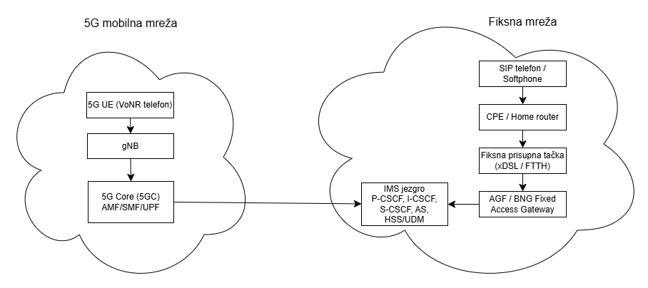
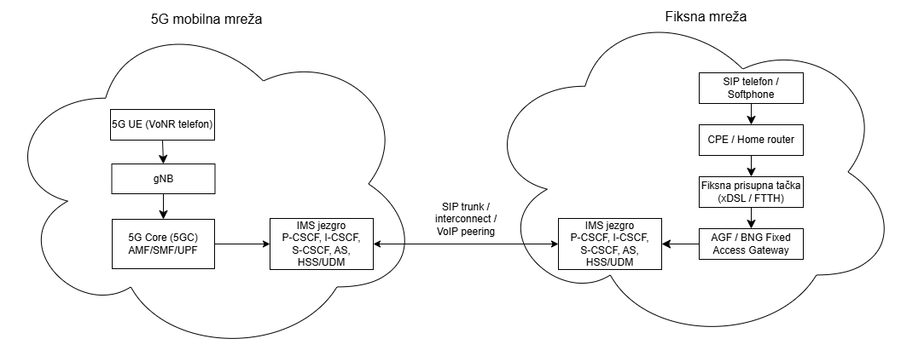

# SSMTK_FMC_VoNR_IMS_5G
Dizajn i implementacija fiksno-mobilne konvergencije (FMC) koja povezuje VoNR u 5G mreži sa IMS/SIP govornom uslugom u fiksnoj mreži, kroz više scenarija IMS jezgra.

<table>
<tr>
  <td><b>Predmet</b></td>
  <td>Sistemi i servisi mobilnih telekomunikacija</td>
</tr>
<tr>
  <td><b>Akademska godina</b></td>
  <td>2025/2026</td>
</tr>
<tr>
  <td><b>Tim</b></td>
  <td align="left">
    <table>
      <tr>
        <td><b>Član tima</b></td>
        <td colspan="2"><b>Alocirani radni paketi</b></td>
      </tr>
      <tr>
        <td>Zakira Jašarević</td>
        <td>RP1</td>
        <td>RP5</td>
      </tr>
      <tr>
        <td>Lejla Porobić</td>
        <td>RP1</td>
        <td>RP4</td>
      </tr>
      <tr>
      <td>
        Amr Saračević</td>
        <td>RP2</td>
        <td>RP3</td>
      </tr>
      <tr>
        <td>Emina Hasković</td>
        <td>RP3</td>
        <td>RP5</td>
      </tr>
      <tr>
        <td>Merjema Varupa</td>
        <td>RP4</td>
        <td>RP6</td>
      </tr>
      <tr>
        <td>Muhamed Crnčalo</td>
        <td>RP2</td>
        <td>RP5</td>
      </tr>
    </table>
  </td>
</tr>
</table>

# Teorijski uvod
Ovaj projekat se bavi dizajnom i praktičnom implementacijom fiksno-mobilne konvergencije (FMC) govorne usluge, gdje se VoNR (Voice over New Radio) u 5G mreži povezuje sa IMS/SIP baziranom govornom uslugom u fiksnoj mreži. Cilj je razumjeti i demonstrirati kako se govorni pozivi uspostavljaju kroz različite arhitekturne scenarije IMS jezgra, te kako se signalizacija i medijski tok ponašaju u realnom test okruženju.

## Definicija FMC-a i njegova važnost
Široka rasprostranjenost širokopojasnih bežičnih tehnologija otvorila je novo razdoblje konvergencije, u kojem se različiti bežični uređaji i pristupne tehnologije koriste za pristup velikom broju usluga. Ova konvergencija, poznata kao fiksno-mobilna konvergencija (FMC), podrazumijeva objedinjavanje bežičnih i žičnih govornih, video i širokopojasnih podatkovnih usluga kroz njihovu neometanu integraciju u jedinstvenu mrežnu cjelinu.[^1]. Dakle, FMC označava integraciju fiksnih i mobilnih servisa tako da korisnik dobije jedinstveno iskustvo, bez obzira da li pristupa kroz mobilnu (5G) ili fiksnu mrežu. U praksi, FMC se često realizuje kroz IMS (IP Multimedia Subsystem) kao servisni sloj za govor (i druge real-time usluge), uz SIP signalizaciju i RTP/RTCP.

## VoNR u 5G SA mreži – osnovni koncept
Voice over New Radio (VoNR) predstavlja proces enkapsulacije govora preko Internet protokola (VoIP) koristeći 5G radio-pristupnu i jezgrenu mrežnu arhitekturu. Time se omogućava prijenos medijskih komponenti preko novog radio-interfejsa, odnosno 5G mreže. Jednostavnije rečeno, VoNR obezbjeđuje govorne usluge u 5G samostalnim (standalone) mrežama.[^2]
I VoLTE i VoNR koriste IP Multimedia Subsystem (IMS), koji omogućava integraciju paketno baziranih poziva u mrežnu infrastrukturu, pri čemu je mobilna mreža izvor komunikacije. Razlika između VoLTE i VoNR leži u osnovnoj mobilnoj mreži i radio arhitekturi na kojoj su zasnovani. Voice over New Radio (VoNR) pretvara telefonske pozive u podatkovne pakete, koji se zatim prenose putem 5G mreže i IMS sistema.

Tipičan tok je:
- UE se registruje u 5GC (NAS/NGAP),
- uspostavlja se PDU sesija (user plane preko UPF),
- UE se zatim registruje na IMS (SIP REGISTER preko P-CSCF),
- poziv se uspostavlja SIP porukama (INVITE/180/200/ACK),
- govor ide preko RTP (medijski tok), uz QoS politike i prioritet govora.

## IMS i SIP – uloga u govornoj usluzi
IMS je arhitekturni okvir koji omogućava operaterima da pružaju govor kroz IP (multimedijalne) servise. Ključne IMS komponente (konceptualno) uključuju:
- P-CSCF (prva SIP tačka za UE, sigurnost i politika),
- I-CSCF / S-CSCF (routing, registracija i servisna logika),
- baza korisnika (HSS/UDM u modernim implementacijama),
- interkonekcijski elementi (npr. SBC/IBCF) za povezivanje sa drugim mrežama,
- aplikacijski serveri (npr. call services), te medijski gateway elementi kada je potrebno.

## Scenariji koji se analiziraju
U projektu se razmatraju tri realna scenarija organizacije IMS jezgra:
- Zajedničko IMS jezgro u 5G mreži: IMS je “u mobilnoj domeni”, a fiksna mreža se veže kao SIP/IMS interkonekcija ili trunk prema tom IMS-u.
- Zajedničko IMS jezgro u fiksnoj mreži: 5G mreža koristi zajedničko IMS jezgro koje je smješteno u fiksnoj domeni.
- Odvojena IMS jezgra (5G IMS i fiksni IMS): Mobilna i fiksna mreža imaju svoje IMS sisteme, koji se povezuju preko SIP peering / interkonekcije (često kroz SBC/IBCF), uz definisana pravila routinga i autentifikacije.
U praktičnom dijelu projekta fokus je na implementaciji i mjerenjima za scenarije (1) i (3), uz poređenje signalizacije i ponašanja sistema.


# RP1: Dizajn koncepta fiksno-mobilne konvergencije (FMC)

U okviru RP1 modelirana su tri arhitekturna scenarija organizacije IMS jezgra u kontekstu FMC govorne usluge.  
U svim scenarijima razlikuju se pristupni domeni (5G mobilna mreža i fiksna pristupna mreža), dok se govor realizuje preko IMS/SIP sloja. Razlika je u tome **gdje se IMS jezgro fizički/logički nalazi** i kako su međusobno povezani mobilni i fiksni korisnici.

---

### Zajednički elementi arhitekture

#### 5G mobilna mreža

- **5G UE (VoNR telefon)** – 5G pametni telefon koji podržava VoNR i sadrži IMS parametre (APN za IMS, SIP domen).  
- **gNB** – 5G bazna stanica koja obezbjeđuje radio pristup i prosljeđuje saobraćaj prema 5G Core-u.  
- **5G Core (AMF/SMF/UPF)**  
  - **AMF** – upravlja pristupom i mobilnošću UE-a (NAS signalizacija, registracija).  
  - **SMF** – upravlja PDU sesijama, IP adresama i QoS parametrima.  
  - **UPF** – provodi korisnički saobraćaj (SIP/RTP) između 5G RAN-a i servisnih platformi (IMS, Internet itd.).

#### Fiksna mreža

- **SIP telefon / Softphone** – krajnji uređaj fiksnog korisnika (IP telefon ili softphone).  
- **CPE / Home router** – kućni ruter koji pruža lokalnu IP konekciju prema operatoru (NAT, osnovni QoS).  
- **Fiksna pristupna tačka (xDSL/FTTH)** – pristupni segment koji povezuje CPE sa mrežom operatora.  
- **AGF / BNG (Fixed Access Gateway)** – agregacioni čvor koji terminiše sesije fiksnih korisnika, obavlja IP agregaciju i QoS te usmjerava SIP/RTP saobraćaj prema IMS-u.

#### IMS jezgro (logičke funkcije)

U zavisnosti od scenarija, IMS jezgro je smješteno u 5G ili u fiksnoj mreži, ili postoje dva odvojena IMS domena. U svim slučajevima IMS obuhvata:
- **P-CSCF** – prvi kontakt za SIP signalizaciju iz mreže.  
- **I-CSCF** – ulazna tačka IMS domena, bira odgovarajući S-CSCF.  
- **S-CSCF** – centralni SIP server koji održava registracije i sesije korisnika te primjenjuje servisna pravila.  
- **AS (Application Servers)** – aplikacijski serveri za dodatne usluge (FMC logika, istovremeno zvonjenje, voicemail itd.).  
- **HSS/UDM** – pretplatnička baza sa profilima mobilnih i fiksnih korisnika (brojevi, identiteti, servisi).

---

### Scenarij (1): Zajedničko IMS jezgro u 5G mreži

U prvom scenariju IMS jezgro je smješteno u **mobilnoj (5G) domeni** i koristi se kao zajednička platforma za VoNR i fiksnu govornu uslugu.

**Tok poziva (primjer 5G UE → fiksni SIP korisnik):**

- 5G UE se registruje u 5GC i uspostavlja PDU sesiju prema IMS APN-u, zatim se registruje na IMS (SIP `REGISTER` preko P-CSCF-a).  
- Fiksni SIP telefon se, preko CPE-a i AGF/BNG-a, registruje na isto IMS jezgro.  
- Pri uspostavi poziva, SIP `INVITE` sa 5G UE prolazi kroz 5GC do IMS-a, gdje S-CSCF pronalazi registraciju fiksnog korisnika i prosljeđuje poziv prema fiksnoj mreži.  
- RTP tok nakon uspostave sesije prati put:
  - `5G UE → gNB → UPF → IP jezgro → AGF/BNG → CPE → SIP telefon`.

Ovaj scenarij naglašava FMC u kojem je **5G mreža “domicilna” za IMS**, a fiksna mreža ulazi kao dodatni pristupni domen.


<div align="center">
<i>Slika 1: Zajedničko IMS jezgro u 5G mreži</i>
</div>

---

### Scenarij (2): Zajedničko IMS jezgro u fiksnoj mreži

U drugom scenariju IMS jezgro je i dalje zajedničko za mobilne i fiksne korisnike, ali je **smješteno u fiksnoj mreži**. 5G domen koristi IMS fiksnog operatora za pružanje VoNR usluge.

**Tok poziva (5G UE → fiksni SIP korisnik):**

- 5G UE se registruje u 5GC, zatim šalje SIP `REGISTER` ka IMS-u u fiksnoj mreži (tunelovan preko UPF-a).  
- Fiksni SIP telefon se registruje lokalno na isto IMS jezgro u fiksnoj mreži.  
- SIP `INVITE` sa 5G UE ide: `UE → gNB → 5GC → IMS P-CSCF (u fiksnoj mreži) → S-CSCF`, koji zatim poziv prosljeđuje prema registraciji fiksnog korisnika.  
- Media saobraćaj teče preko UPF-a i IP jezgra prema fiksnoj strani.

Ovaj scenarij odgovara situaciji u kojoj **fiksni IMS postoji kao centralna platforma**, a 5G mreža ga koristi kao servisni sloj za govor.


<div align="center">
<i>Slika 2: Zajedničko IMS jezgro u fiksnoj mreži</i>
</div>

---

### Scenarij (3): Odvojena IMS jezgra za 5G i fiksnu mrežu

Treći scenarij predstavlja pristup u kojem 5G i fiksna mreža imaju **dva odvojena IMS domena**, sa zasebnim pretplatničkim bazama i servisnim logikama. Između ova dva IMS sistema uspostavljen je SIP trunk / peering.

**Tok poziva (5G UE → fiksni SIP korisnik):**

- 5G UE je registrovan na IMS-5G, a fiksni SIP telefon na IMS-F; svaki koristi vlastitu pretplatničku bazu i servisni profil.  
- SIP `INVITE` sa 5G UE ide prema S-CSCF-5G, koji na osnovu broja ili domene prepoznaje da se pozvani korisnik nalazi u fiksnoj IMS mreži.  
- Poziv se preusmjerava preko SIP trunk veze: `IMS-5G → IMS-F`, gdje S-CSCF-F pronalazi registraciju fiksnog korisnika i dostavlja poziv do SIP telefona.  
- Media saobraćaj se uspostavlja direktno između domena ili preko media gateway-a, u zavisnosti od konfiguracije trunk-a i eventualnog transkodiranja.

U ovom scenariju konvergencija se ostvaruje **na nivou interkonekcije dva IMS sistema**, a ne kroz jedno zajedničko jezgro, što omogućava veću nezavisnost domena, ali i kompleksnije upravljanje routiranjem i politikama.


<div align="center">
<i>Slika 3: Odvojena IMS jezgra za 5G i fiksnu mrežu</i>
</div>

---

# Plan rada
## Radni paketi

### RP1: Dizajn koncepta FMC
**Zaduženi:** Zakira, Lejla  
**Opis:** Definisati FMC koncept koji povezuje VoNR i IMS/SIP fiksne mreže uz scenarije:
1) zajedničko IMS jezgro u 5G mreži  
2) zajedničko IMS jezgro u fiksnoj mreži  
3) odvojena IMS jezgra 5G i fiksne mreže

**Plan isporuke**
- [ ] Arhitekturni dijagrami
- [ ] Opis signalizacijskih tokova (visok nivo)
- [ ] Pretpostavke i ograničenja
- [ ] Lista potrebne opreme/softvera

**Rezultati**
- (linkovi na dijagrame/dokumente)

---

### RP2: Implementacija VoNR usluge
**Zaduženi:** Amr, Muhamed  
**Opis:** Implementacija VoNR korištenjem AMARI Callbox Mini rješenja i 5G mobilnih telefona.

**Plan isporuke**
- [ ] Postavka testnog okruženja
- [ ] Registracija i uspostava poziva
- [ ] Evidencija konfiguracija
- [ ] Screenshotovi/logovi

**Rezultati**
- (linkovi)

---

### RP3: Implementacija FMC za scenarij (1)
**Zaduženi:** Emina, Amr  
**Opis:** FMC za slučaj gdje je IMS jezgro zajedničko i nalazi se u 5G mreži.

**Plan isporuke**
- [ ] Implementacijski koraci
- [ ] Test scenariji
- [ ] Logovi signalizacije

**Rezultati**
- (linkovi)

---

### RP4: Implementacija FMC za scenarij (3)
**Zaduženi:** Merjema, Lejla  
**Opis:** FMC za slučaj gdje su IMS jezgra 5G i fiksne mreže odvojene.

**Plan isporuke**
- [ ] Implementacijski koraci
- [ ] Test scenariji
- [ ] Logovi signalizacije

**Rezultati**
- (linkovi)

---

### RP5: Eksperimentalna analiza signalizacijskih tokova
**Zaduženi:** Zakira, Emina, Muhamed

**Opis:** Analiza signalizacijskih tokova za scenarije (1) i (3).

**Plan isporuke**
- [ ] Definisati šta se tačno snima/posmatra
- [ ] Prikupiti logove
- [ ] Napraviti sekvencne dijagrame
- [ ] Zaključci i poređenje

**Rezultati**
- (linkovi)

---

## RP6: Repo & dokumentacija
**Zaduženi:** Merjema  
- Održavanje strukture repozitorija
- Ažuriranje README-a
- Otvaranje i praćenje Issues
- Sedmični “status update”

## Struktura repozitorija (prijedlog)

```
/docs  
  /rp1-design  
  /rp3-fmc-s1  
  /rp4-fmc-s3  
  /rp5-analysis  
/config  
/scripts  
/assets
  /images  
```

## Dnevnik promjena
- 2025-12-09: Kreiran repo i inicijalni README.
- 2025-12-14: Ažuriran README - kreiran teorijski uvod i inicijalna arhitektura.

# Literatura:
[^1]: Raj, M., Narayan, A., Datta, S., Das, S. K., & Pathak, J. K. (2010). Fixed mobile convergence: challenges and solutions. IEEE Communications Magazine, 48(12), 26-34.
[^2]: What is Voice over New Radio (VoNR). NG-Voice. Dostupno na: https://www.ng-voice.com/learning-center/what-is-voice-over-new-radio-vonr#what-is-voice-over-new-radio-vonr -->
