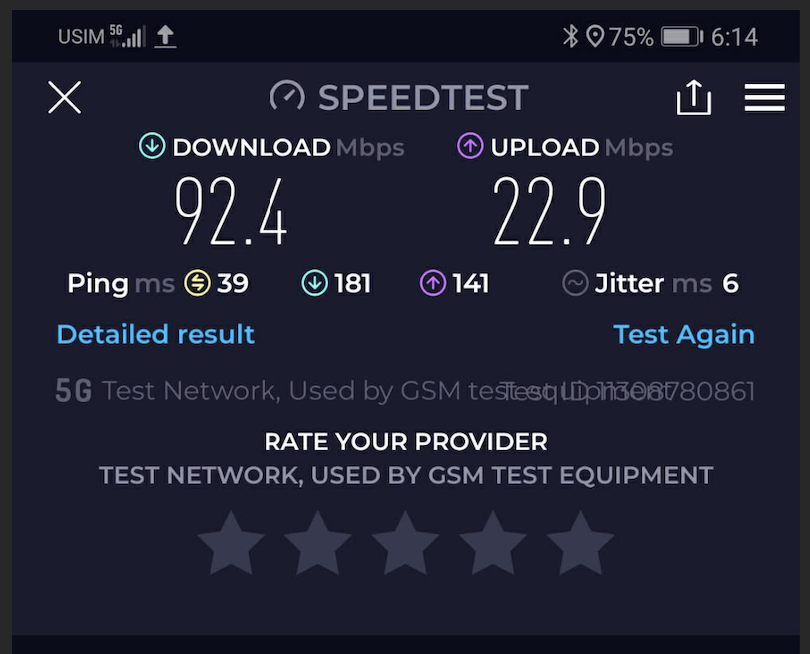
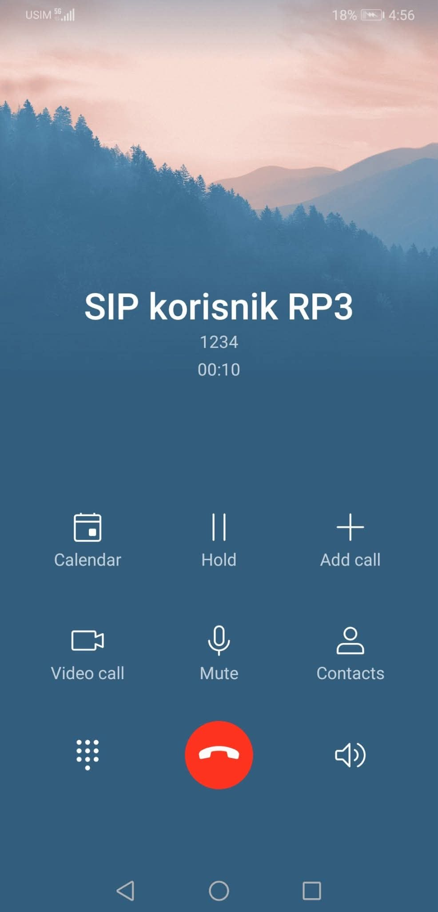

# SSMTK_FMC_VoNR_IMS_5G
<table>
<tr>
  <th><b>Predmet</b></th>
  <td>Sistemi i servisi mobilnih telekomunikacija</td>
</tr>
<tr>
  <th><b>Akademska godina</b></th>
  <td>2025/2026</td>
</tr>
<tr>
  <th><b>Projektni zadatak</b></th>
  <td>Fiksno-mobilna konvergencija govorne usluge u 5G mreži</td>
</tr>
<tr>
  <th><b>Opis projektnog zadatka</b></th>
  <td>Dizajn i implementacija fiksno-mobilne konvergencije (FMC) koja povezuje VoNR u 5G mreži sa IMS/SIP govornom uslugom u fiksnoj mreži, kroz više scenarija IMS jezgra.</td>
</tr>
<tr>
  <th><b>Tim</b></th>
  <td align="left">
    <table>
      <tr>
        <th><b>Član tima</b></th>
        <th colspan="2"><b><a href="#radni-paketi">Alocirani radni paketi</a></b></th>
      </tr>
      <tr>
        <td>Zakira Jašarević</td>
        <td>RP1</td>
        <td>RP5</td>
      </tr>
      <tr>
        <td>Lejla Porobić</td>
        <td>RP1</td>
        <td>RP4</td>
      </tr>
      <tr>
      <td>
        Amr Saračević</td>
        <td>RP2</td>
        <td>RP3</td>
      </tr>
      <tr>
        <td>Emina Hasković</td>
        <td>RP3</td>
        <td>RP5</td>
      </tr>
      <tr>
        <td>Merjema Varupa</td>
        <td>RP4</td>
        <td>RP6</td>
      </tr>
      <tr>
        <td>Muhamed Crnčalo</td>
        <td>RP2</td>
        <td>RP5</td>
      </tr>
    </table>
  </td>
</tr>
</table>

# Teorijski uvod
Ovaj projekat se bavi dizajnom i praktičnom implementacijom fiksno-mobilne konvergencije (FMC) govorne usluge, gdje se VoNR (Voice over New Radio) u 5G mreži povezuje sa IMS/SIP baziranom govornom uslugom u fiksnoj mreži. Cilj je razumjeti i demonstrirati kako se govorni pozivi uspostavljaju kroz različite arhitekturne scenarije IMS jezgra, te kako se signalizacija i medijski tok ponašaju u realnom test okruženju.

## Definicija FMC-a i njegova važnost
Široka rasprostranjenost širokopojasnih bežičnih tehnologija otvorila je novo razdoblje konvergencije, u kojem se različiti bežični uređaji i pristupne tehnologije koriste za pristup velikom broju usluga. Ova konvergencija, poznata kao fiksno-mobilna konvergencija (FMC), podrazumijeva objedinjavanje bežičnih i žičnih govornih, video i širokopojasnih podatkovnih usluga kroz njihovu neometanu integraciju u jedinstvenu mrežnu cjelinu.[^1]. Dakle, FMC označava integraciju fiksnih i mobilnih servisa tako da korisnik dobije jedinstveno iskustvo, bez obzira da li pristupa kroz mobilnu (5G) ili fiksnu mrežu. U praksi, FMC se često realizuje kroz IMS (IP Multimedia Subsystem) kao servisni sloj za govor (i druge real-time usluge), uz SIP signalizaciju i RTP/RTCP.

## VoNR u 5G SA mreži – osnovni koncept
Voice over New Radio (VoNR) predstavlja proces enkapsulacije govora preko Internet protokola (VoIP) koristeći 5G radio-pristupnu i jezgrenu mrežnu arhitekturu. Time se omogućava prijenos medijskih komponenti preko novog radio-interfejsa, odnosno 5G mreže. Jednostavnije rečeno, VoNR obezbjeđuje govorne usluge u 5G samostalnim (standalone) mrežama.[^2]
I VoLTE i VoNR koriste IP Multimedia Subsystem (IMS), koji omogućava integraciju paketno baziranih poziva u mrežnu infrastrukturu, pri čemu je mobilna mreža izvor komunikacije. Razlika između VoLTE i VoNR leži u osnovnoj mobilnoj mreži i radio arhitekturi na kojoj su zasnovani. Voice over New Radio (VoNR) pretvara telefonske pozive u podatkovne pakete, koji se zatim prenose putem 5G mreže i IMS sistema.

Tipičan tok je:
- UE se registruje u 5GC (NAS/NGAP),
- uspostavlja se PDU sesija (user plane preko UPF),
- UE se zatim registruje na IMS (SIP REGISTER preko P-CSCF),
- poziv se uspostavlja SIP porukama (INVITE/180/200/ACK),
- govor ide preko RTP (medijski tok), uz QoS politike i prioritet govora.

## IMS i SIP – uloga u govornoj usluzi
IMS je arhitekturni okvir koji omogućava operaterima da pružaju govor kroz IP (multimedijalne) servise. Ključne IMS komponente (konceptualno) uključuju:
- P-CSCF (prva SIP tačka za UE, sigurnost i politika),
- I-CSCF / S-CSCF (routing, registracija i servisna logika),
- baza korisnika (HSS/UDM u modernim implementacijama),
- interkonekcijski elementi (npr. SBC/IBCF) za povezivanje sa drugim mrežama,
- aplikacijski serveri (npr. call services), te medijski gateway elementi kada je potrebno.

## Scenariji koji se analiziraju
U projektu se razmatraju tri realna scenarija organizacije IMS jezgra:
- Zajedničko IMS jezgro u 5G mreži: IMS je “u mobilnoj domeni”, a fiksna mreža se veže kao SIP/IMS interkonekcija ili trunk prema tom IMS-u.
- Zajedničko IMS jezgro u fiksnoj mreži: 5G mreža koristi zajedničko IMS jezgro koje je smješteno u fiksnoj domeni.
- Odvojena IMS jezgra (5G IMS i fiksni IMS): Mobilna i fiksna mreža imaju svoje IMS sisteme, koji se povezuju preko SIP peering / interkonekcije (često kroz SBC/IBCF), uz definisana pravila routinga i autentifikacije.
U praktičnom dijelu projekta fokus je na implementaciji i mjerenjima za scenarije (1) i (3), uz poređenje signalizacije i ponašanja sistema.

# RP1: Dizajn koncepta fiksno-mobilne konvergencije (FMC)
U okviru RP1 modelirana su tri arhitekturna scenarija organizacije IMS jezgra u kontekstu FMC govorne usluge.  
U svim scenarijima razlikuju se pristupni domeni (5G mobilna mreža i fiksna pristupna mreža), dok se govor realizuje preko IMS/SIP sloja. Razlika je u tome **gdje se IMS jezgro fizički/logički nalazi** i kako su međusobno povezani mobilni i fiksni korisnici.

---

### Zajednički elementi arhitekture
#### 5G mobilna mreža
- **5G UE (VoNR telefon)** – 5G pametni telefon koji podržava VoNR i sadrži IMS parametre (APN za IMS, SIP domen).  
- **gNB** – 5G bazna stanica koja obezbjeđuje radio pristup i prosljeđuje saobraćaj prema 5G Core-u.  
- **5G Core (AMF/SMF/UPF)**  
  - **AMF** – upravlja pristupom i mobilnošću UE-a (NAS signalizacija, registracija).  
  - **SMF** – upravlja PDU sesijama, IP adresama i QoS parametrima.  
  - **UPF** – provodi korisnički saobraćaj (SIP/RTP) između 5G RAN-a i servisnih platformi (IMS, Internet itd.).

#### Fiksna mreža
- **SIP telefon / Softphone** – krajnji uređaj fiksnog korisnika (IP telefon ili softphone).  
- **CPE / Home router** – kućni ruter koji pruža lokalnu IP konekciju prema operatoru (NAT, osnovni QoS).  
- **Fiksna pristupna tačka (xDSL/FTTH)** – pristupni segment koji povezuje CPE sa mrežom operatora.  
- **AGF / BNG (Fixed Access Gateway)** – agregacioni čvor koji terminiše sesije fiksnih korisnika, obavlja IP agregaciju i QoS te usmjerava SIP/RTP saobraćaj prema IMS-u.

#### IMS jezgro (logičke funkcije)
U zavisnosti od scenarija, IMS jezgro je smješteno u 5G ili u fiksnoj mreži, ili postoje dva odvojena IMS domena. U svim slučajevima IMS obuhvata:
- **P-CSCF** – prvi kontakt za SIP signalizaciju iz mreže.  
- **I-CSCF** – ulazna tačka IMS domena, bira odgovarajući S-CSCF.  
- **S-CSCF** – centralni SIP server koji održava registracije i sesije korisnika te primjenjuje servisna pravila.  
- **AS (Application Servers)** – aplikacijski serveri za dodatne usluge (FMC logika, istovremeno zvonjenje, voicemail itd.).  
- **HSS/UDM** – pretplatnička baza sa profilima mobilnih i fiksnih korisnika (brojevi, identiteti, servisi).

---

### Scenarij (1): Zajedničko IMS jezgro u 5G mreži
U prvom scenariju IMS jezgro je smješteno u **mobilnoj (5G) domeni** i koristi se kao zajednička platforma za VoNR i fiksnu govornu uslugu.

**Tok poziva (primjer 5G UE → fiksni SIP korisnik):**
- 5G UE se registruje u 5GC i uspostavlja PDU sesiju prema IMS APN-u, zatim se registruje na IMS (SIP `REGISTER` preko P-CSCF-a).  
- Fiksni SIP telefon se, preko CPE-a i AGF/BNG-a, registruje na isto IMS jezgro.  
- Pri uspostavi poziva, SIP `INVITE` sa 5G UE prolazi kroz 5GC do IMS-a, gdje S-CSCF pronalazi registraciju fiksnog korisnika i prosljeđuje poziv prema fiksnoj mreži.  
- RTP tok nakon uspostave sesije prati put:
  - `5G UE -> gNB -> UPF -> IP jezgro -> AGF/BNG -> CPE -> SIP telefon`.

Ovaj scenarij naglašava FMC u kojem je **5G mreža “domicilna” za IMS**, a fiksna mreža ulazi kao dodatni pristupni domen.

<div align="center">
  
  <br>
  <i>Slika 1: Zajedničko IMS jezgro u 5G mreži</i>
</div>

---

### Scenarij (2): Zajedničko IMS jezgro u fiksnoj mreži
U drugom scenariju IMS jezgro je i dalje zajedničko za mobilne i fiksne korisnike, ali je **smješteno u fiksnoj mreži**. 5G domen koristi IMS fiksnog operatora za pružanje VoNR usluge.

**Tok poziva (5G UE → fiksni SIP korisnik):**
- 5G UE se registruje u 5GC, zatim šalje SIP `REGISTER` ka IMS-u u fiksnoj mreži (tunelovan preko UPF-a).  
- Fiksni SIP telefon se registruje lokalno na isto IMS jezgro u fiksnoj mreži.  
- SIP `INVITE` sa 5G UE ide: `UE → gNB → 5GC → IMS P-CSCF (u fiksnoj mreži) → S-CSCF`, koji zatim poziv prosljeđuje prema registraciji fiksnog korisnika.  
- Media saobraćaj teče preko UPF-a i IP jezgra prema fiksnoj strani.

Ovaj scenarij odgovara situaciji u kojoj **fiksni IMS postoji kao centralna platforma**, a 5G mreža ga koristi kao servisni sloj za govor.

<div align="center">
  
  <br>
  <i>Slika 2: Zajedničko IMS jezgro u fiksnoj mreži</i>
</div>

---

### Scenarij (3): Odvojena IMS jezgra za 5G i fiksnu mrežu
Treći scenarij predstavlja pristup u kojem 5G i fiksna mreža imaju **dva odvojena IMS domena**, sa zasebnim pretplatničkim bazama i servisnim logikama. Između ova dva IMS sistema uspostavljen je SIP trunk / peering.

**Tok poziva (5G UE → fiksni SIP korisnik):**

- 5G UE je registrovan na IMS-5G, a fiksni SIP telefon na IMS-F; svaki koristi vlastitu pretplatničku bazu i servisni profil.  
- SIP `INVITE` sa 5G UE ide prema S-CSCF-5G, koji na osnovu broja ili domene prepoznaje da se pozvani korisnik nalazi u fiksnoj IMS mreži.  
- Poziv se preusmjerava preko SIP trunk veze: `IMS-5G → IMS-F`, gdje S-CSCF-F pronalazi registraciju fiksnog korisnika i dostavlja poziv do SIP telefona.  
- Media saobraćaj se uspostavlja direktno između domena ili preko media gateway-a, u zavisnosti od konfiguracije trunk-a i eventualnog transkodiranja.

U ovom scenariju konvergencija se ostvaruje **na nivou interkonekcije dva IMS sistema**, a ne kroz jedno zajedničko jezgro, što omogućava veću nezavisnost domena, ali i kompleksnije upravljanje routiranjem i politikama.

<div align="center">
  
  <br>
  <i>Slika 3: Odvojena IMS jezgra za 5G i fiksnu mrežu</i>
</div>

---

# RP2: Implementacija VoNR usluge korištenjem AMARI Callbox Mini rješenja i 5G mobilnih telefona
U okviru eksperimenta uspješno je izvršeno povezivanje korisničkog uređaja na 5G mrežu i verifikovana osnovna funkcionalnost mrežnog i servisnog sloja.

### Uspostava 5G 
Prelazak na 5G vrši se pozivom sljedećih naredbi kao root unutar foldera /enb:

```shell
ln -sfn gnb-sa.cfg enb.cfg
service lte start
```

Mobilni uređaj je uspješno registrovan na baznu stanicu i ostvarena je 5G (NR) konekcija, što je potvrđeno statusom mreže na uređaju. Tokom testiranja, uređaj je radio u 5G režimu sa stabilnim radio linkom.

### Verifikacija podatkovne konekcije
Izvršeno je mjerenje performansi mreže. Ostvarene su stabilne vrijednosti download i upload brzine, uz prihvatljive vrijednosti kašnjenja i jittera, bez detektovanog gubitka paketa. Ovi rezultati potvrđuju ispravnu uspostavu podatkovnog prenosa preko 5G mreže.

<div align="center">
  
  <br>
  <i>Slika 4: Verifikacija podatkovne konekcije</i>
</div>

---

### Uspostava poziva sa AMARI Callbox Mini ka mobilnom UE

Nakon uspješne registracije mobilnog uređaja na 5G mrežu i IMS, poziv je iniciran direktno sa strane AMARI Callbox Mini sistema.

U terminalu je prvo pozicioniranje izvršeno unutar direktorija:

```
cd/enb
```

Zatim je pristupljeno aktivnoj screen sesiji u kojoj je pokrenut LTE/5G stack:

```
screen -x lte
```

Ovom naredbom se otvara interaktivni multi-panelni screen interfejs AMARI sistema, koji sadrži više virtuelnih prozora (panela) za nadzor i upravljanje različitim komponentama sistema (gNB/eNB, 5G Core, IMS, sistemski logovi). Unutar screen interfejsa, izvršen je prelazak na IMS panel korištenjem sljedeće kombinacije tipki **Ctrl + a + 3**. Panel sa indeksom 3 predstavlja IMS kontrolni interfejs, koji omogućava upravljanje IMS funkcijama i iniciranje poziva. Nakon što je IMS panel aktivan, poziv je iniciran sljedećom naredbom:

```
mt_call 0600000124
```
Ova komanda pokreće mobilno-terminirani poziv (Mobile Terminated Call) prema navedenom broju, koristeći IMS/VoNR servisni sloj. Poziv je iniciran i održan bez prekida, što ukazuje na pravilno funkcionisanje mrežne infrastrukture i povezanih servisa.

<div align="center">
  
  <br>
  <i>Slika 5: Uspostava poziva</i>
</div>

---

### Snimanje mrežnog saobraćaja upotrebom Wireshark alata za VoNR u 5G mreži
Tokom testiranja uspostave VoNR poziva izvršeno je snimanje mrežnog saobraćaja u .pcap formatu radi kasnije analize signalizacijskih i transportnih tokova. Snimanje je realizovano korištenjem alata `tcpdump`, na relevantnom mrežnom interfejsu AMARI sistema, u realnom vremenu. 

```
tcpdump -i lo -w /root/capture/rp2_snimak.pcap
```

Dobijeni .pcap fajl sadrži:
- SCTP saobraćaj (NGAP signalizacija između gNB i 5GC),
- GTP tunelovani saobraćaj (korisnički i kontrolni tokovi),
- heartbeat poruke koje potvrđuju aktivne i stabilne veze između mrežnih elemenata.
  
Signalizacijski i govorni tokovi u VoNR scenariju su kriptovani:
- IMS signalizacija koristi SIP over TLS,
- govorni tok koristi SRTP.
Zbog toga sadržaj SIP poruka i audio signala nije direktno vidljiv u Wiresharku, dok su dostupni meta-podaci (protokoli, vremenski odnosi, redoslijed paketa), što odgovara realnim operativnim 5G mrežama.

<div align="center">
  
  <br>
  <i>Slika 6: Snimanje mrežnog saobraćaja u Wireshark alatu za VoNR u 5G mreži</i>
</div>

---

# RP3: Implementacija FMC za scenarij (1) – zajedničko IMS jezgro u 5G mreži

U okviru RP3 realizovan je FMC scenarij (1), u kojem se zajedničko IMS jezgro nalazi u 5G mreži (AMARI Callbox Mini) i istovremeno opslužuje:
- 5G VoNR korisnika (mobilni UE),
- fiksnog SIP korisnika (MicroSIP client na PC-u).
Cilj ovog radnog paketa je bio uspostaviti i verifikovati istovremenu IMS registraciju mobilnog i fiksnog korisnika na istom IMS jezgru, što predstavlja osnovni preduslov za fiksno-mobilnu konvergenciju govorne usluge.

### Fiksni SIP korisnik – MicroSIP

Kao fiksni korisnički terminal korišten je MicroSIP (v3.22.3) softphone, instaliran na računaru u IP mreži povezanoj sa IMS jezgrom AMARI Callbox Mini sistema. MicroSIP je u ovom scenariju predstavljao fiksnog korisnika FMC sistema, dok je mobilni korisnik realizovan kao VoNR UE u 5G mreži.

MicroSIP je konfigurisan tako da se registruje na isto IMS jezgro koje koristi VoNR mobilni korisnik i korišteni su sljedeći parametri:

- SIP server / Registrar: 192.168.200.160
- SIP domena: ims.mnc001.mcc001.3gppnetwork.org
- SIP korisnik (IMPU): sip:1234@ims.mnc001.mcc001.3gppnetwork.org
- Auth ID (IMPI): sipclient
- Password: sipclient
- Transport: UDP

<div align="center">
  
  <br>
  <i>Slika 7: Konfiguracija MicroSIP klijenta na isto IMS jezgro koje koristi VoNR mobilni korisnik</i>
</div>

Lokalni port je dinamički, dodijeljen od strane klijenta. Ova konfiguracija odgovara SIP korisniku definisanom u IMS bazi (ue_db-ims.cfg) i koristi standardni SIP Digest (MD5) autentifikacioni mehanizam.

Nakon pokretanja MicroSIP-a, izvršena je uspješna SIP registracija na IMS jezgro. Registracija je realizovana kroz standardni SIP tok:

- REGISTER
- 401 Unauthorized (Digest izazov)
- REGISTER (sa Authorization headerom)
- 200 OK

Fiksni SIP korisnik, također, je definisan u datoteci ue_db-ims.cfg kao standardni IMS/SIP korisnik sa Digest (MD5) autentifikacijom.

```
{
  /* Dummy SIM information */
  sim_algo: "xor",
  imsi: "000000000000000",
  K: "00000000000000000000000000000000",
  amf: 0x0000,

  /* SIP user for FMC */
  impi: "sipclient",
  impu: [
    "sip:1234@ims.mnc001.mcc001.3gppnetwork.org",
    "tel:1234"
  ],
  pwd: "sipclient",
  authent_type: "MD5"
},
```

Ovim su definisani IMPI privatni identitet za autentifikaciju (sipclient) i IMPU – javni identiteti (SIP URI i telefonski broj), te autentifikacija kao standardni SIP Digest (MD5).

Nakon izmjena konfiguracije, IMS i LTE servisi su restartovani, što se podrazumijeva pri svakoj izmjeni konfiguracijskih fajlova:

```shell
service lte stop
service lte start
```

U IMS CLI izlazu ((ims) users) prikazanom na Slici 8 MicroSIP korisnik je vidljiv kao registrovan SIP korisnik sa aktivnim SIP bindingom, uključujući IP adresu računara i dodijeljeni lokalni port. Ovim je potvrđeno da MicroSIP ispravno komunicira sa IMS jezgrom i da je spreman za uspostavu FMC poziva.

### Konfiguracija IMS servisa - Callbox Mini

IMS servis je konfigurisan kroz datoteku ims.cfg. Ključne postavke uključuju SIP bind adrese, rad u 3GPP režimu i učitavanje baze IMS korisnika.
```
sip_addr: [
  {addr: "192.168.200.160", bind_addr: "192.168.200.160", port_min: 10000, port_max: 20000, trunk: false},
  "2001:468:3000:1::"
],

/* Global domain name */
domain: "amarisoft.com",

/* IMS user database */
include "ue_db-ims.cfg",

/* 3GPP IMS mode */
precondition: true,

/* IPSec algorithms */
ipsec_aalg_list: ["hmac-md5-96", "hmac-sha-1-96"],
ipsec_ealg_list: ["null", "aes-cbc", "des-cbc", "des-ede3-cbc"],
```
Također, za uspješnu uspostavu govornog poziva između MicroSIP klijenta i VoNR mobilnog telefona unutar istog IMS jezgra, bilo je neophodno koristiti 3GPP preconditions mehanizam. U 3GPP IMS/VoLTE/VoNR okruženju, preduslovi (engl. preconditions) služe da se prije prihvatanja poziva potvrdi da su resursi rezervisani, QoS politika primijenjena, te medijski tok pripremljen za govor. U praksi to znači da IMS u 3GPP režimu očekuje da krajnji korisnici (ili barem relevantni identiteti) budu označeni kao korisnici koji podržavaju preconditions. Bez toga može doći do situacije da SIP signalizacija krene ispravno, ali se poziv ne uspostavi korektno (npr. ne prođe offer/answer faza kako IMS očekuje) ili se sesija prekine zbog neusaglašenih zahtjeva prema QoS preduvjetima. Zbog toga je osim globalnog podešavanja precondition: true u ims.cfg bilo potrebno uključiti preconditions i na nivou korisničkog identiteta unutar datotetke ue_db-ims.cfg na način:

```
impu: [
      "001010123456789",
      { impu: "tel:0600000124", imei: "867786040633402", precondition: "on" },
      ]
```

Na taj način IMS tretira taj identitet kao 3GPP korisnika koji podržava preconditions, što je bilo potrebno da poziv MicroSIP → VoNR UE bude uspješno uspostavljen u zajedničkom IMS jezgru.

### Verifikacija FMC scenarija (1)

Uspješna realizacija RP3 potvrđena je komandom:

```shell
(ims) users
```

Rezultat prikazuje istovremeno registrovane VoNR mobilnog korisnika (IMS + IPSec, 3GPP) i fiksnog SIP korisnika (sipclient) sa PC-a.

<div align="center">
  
  <br>
  <i>Slika 8: Izlaz komande <code>(ims) users</code>. Prikazan je VoNR korisnik registrovan uz IPSec zaštitu (gornji dio) i standardni SIP korisnik <code>sipclient</code> registrovan sa PC-a (donji dio). Ovo potvrđuje da oba korisnika koriste isto IMS jezgro </i>
</div>

Nakon uspješne IMS registracije oba korisnika, izvršena je uspostava FMC govornog poziva iniciranog sa fiksnog SIP klijenta (MicroSIP) prema mobilnom VoNR korisniku. Poziv je rutiran kroz zajedničko IMS jezgro u 5G mreži.

<div align="center"> <table> <tr> <td align="center" width="50%"> 

<i><b>Slika 9a:</b> Iniciranje FMC poziva sa fiksnog SIP klijenta (MicroSIP) prema mobilnom korisniku <code>0600000124</code>.</i>

</td> <td align="center" width="50%"> 

<i><b>Slika 9b:</b> Dolazni i aktivni FMC govorni poziv na VoNR mobilnom uređaju, sa prikazanim identitetom pozivaoca <code>SIP korisnik RP3</code> i trajanjem poziva.</i>

</td> </tr> </table> </div>

Uspješna uspostava i održavanje poziva potvrđuju ispravnu IMS registraciju fiksnog i mobilnog korisnika, korektno SIP rutiranje kroz zajedničko IMS jezgro, te funkcionalan govorni (medijski) tok između fiksne i mobilne mreže.

---

# RP4 – Implementacija FMC za scenarij (3): odvojena IMS jezgra 5G i fiksne mreže

U okviru RP4 pokušana je realizacija fiksno-mobilne konvergencija (FMC) u scenariju u kojem 5G mreža i fiksna SIP mreža imaju odvojena IMS jezgra. Integracija je ostvarena korištenjem Asterisk-a kao SIP gateway-a između fiksne SIP domene i IMS jezgra 5G mreže (Amarisoft Callbox Mini).

## Arhitektura rješenja (RP4 kontekst)
U ovom scenariju:
- 5G korisnici koriste VoNR/VoLTE preko IMS jezgra u 5G mreži,
- fiksni korisnici koriste SIP softphone (Microsip),
- Asterisk posreduje signalizaciju i RTP tokove između dvije domene,
- IMS jezgra nisu zajednička, već međusobno povezane preko SIP trunk-a.

## Podrška za AMR kodek u Asterisku

Podrazumijevana verzija Asteriska ne podržava AMR (Adaptive Multi-Rate) kodek. To predstavlja ograničenje u scenarijima gdje se koriste SIP/IMS klijenti koji rade sa AMR kodekom, kao što je MicroSIP, koji AMR podršku ima implementiranu i aktivno je koristi prilikom SIP pregovaranja kodeka (SDP).

Zbog toga je u sistemu dolazilo do nekompatibilnosti kodeka i neuspješnog uspostavljanja poziva između SIP klijenta i Asterisk jezgra. 

## Razlog proširenja Asteriska

U okviru projekta bilo je potrebno omogućiti:
  - interoperabilnost između AMR-capable SIP klijenata (MicroSIP) i Asterisk jezgra,
  - pravilno SIP/SDP pregovaranje kodeka,
  - uspješno uspostavljanje govornih poziva u IMS/FMC testnom okruženju.

Kako Asterisk ne nudi nativnu AMR podršku, bilo je neophodno proširiti Asterisk dodatnim AMR kodek modulom.

## Implementirano rješenje

AMR podrška je realizovana integracijom otvorenog (open-source) AMR modula za Asterisk, dostupnog na sljedećem repozitoriju:

🔗 https://github.com/traud/asterisk-amr

Ovaj modul omogućava:

  - dodavanje AMR kodeka u Asterisk;
  - pravilno kodiranje i dekodiranje AMR govornog signala;
  - uspješno pregovaranje AMR kodeka u SIP/SDP razmjeni;
  - interoperabilnost sa SIP klijentima koji koriste AMR kodek (npr. MicroSIP).

## Rezultat integracije

Nakon proširenja Asteriska:
  - pozivi između MicroSIP klijenta i Asterisk jezgra se uspješno uspostavljaju,
  - AMR kodek se ispravno pregovara i koristi tokom poziva,
  - sistem postaje kompatibilan sa IMS okruženjem i mobilnim mrežama gdje je AMR standardni govorni kodek.

Ovo proširenje je bilo ključni korak za realizaciju funkcionalne fiksno-mobilne konvergencije (FMC) govorne usluge u našem projektnom okruženju.

---

## Asterisk – PJSIP konfiguracija i dodavanje IMS SIP trunk-a

## Asterisk – rutiranje poziva
U fajlu **`/etc/asterisk/extensions.conf`** definisana su pravila rutiranja poziva između fiksne SIP domene i IMS domene:


# RP5: Eksperimentalna analiza signalizacijskih tokova

## Analiza signalizacijskih tokova za scenarij (1)
## Analiza signalizacijskih tokova za scenarije (3)

<details id="radni-paketi">
<summary title="Kliknite za prikaz radnih paketa.">Radni paketi</summary>
<table>
  <tr>
    <td><b>Radni paket</b></td>
    <td><b>Opis</b></td>
    <td><b>Plan isporuke</b></td>
  </tr>
  <tr>
    <td>RP1 - Dizajn koncepta FMC</td>
    <td>Definisati FMC koncept koji povezuje VoNR i IMS/SIP fiksne mreže uz scenarije zajedničkog IMS jezgra u 5G mreži, zajedničkog jezgra u fiksnoj mreži i odvojena IMS jezgra 5G i fiksne mreže.
    </td>
    <td>
      <ul>
        <li>Arhitekturni dijagrami</li>
        <li>Opis signalizacijskih tokova (visok nivo)</li>
        <li>Pretpostavke i ograničenja</li>
        <li>Lista potrebne opreme/softvera</li>
      </ul>
    </td>
  </tr>
  <tr>
    <td>RP2 - Implementacija VoNR usluge</td>
    <td>Implementacija VoNR korištenjem AMARI Callbox Mini rješenja i 5G mobilnih telefona.</td>
    <td>
      <ul>
        <li>Postavka testnog okruženja</li>
        <li>Registracija i uspostava poziva</li>
        <li>Evidencija konfiguracija</li>
        <li>Screenshotovi/logovi</li>
      </ul>
    </td>
  </tr>
  <tr>
    <td>RP3 - Implementacija FMC za scenarij (1)</td>
    <td>FMC za slučaj gdje je IMS jezgro zajedničko i nalazi se u 5G mreži.</td> 
    <td>
      <ul>
        <li>Implementacijski koraci</li>
        <li>Test scenariji</li>
        <li>Logovi signalizacije</li>
      </ul>
    </td>
  </tr>
  <tr>
    <td>RP4 - Implementacija FMC za scenarij (3)</td> 
    <td>FMC za slučaj gdje su IMS jezgra 5G i fiksne mreže odvojene.</td>
    <td>
      <ul>
        <li>Implementacijski koraci</li>
        <li>Test scenariji</li>
        <li>Logovi signalizacije</li>
      </ul>
    </td> 
  </tr>
  <tr>
   <td>RP5 - Eksperimentalna analiza signalizacijskih tokova</td> 
   <td>Analiza signalizacijskih tokova za scenarije (1) i (3).</td> 
  <td>
    <ul>
      <li>Definisati šta se tačno snima/posmatra</li>
      <li>Prikupiti logove</li>
      <li>Napraviti sekvencne dijagrame</li>
      <li>Zaključci i poređenje</li>
    </ul>
  </td>
  </tr>
  <tr>
   <td>RP6 - Repozitorij i dokumentacija</td> 
    <td>
      Održavanje strukture repozitorija, ažuriranje svih datotek ažuriranje svih datoteka i predlaganje ideja za poboljšanje postojećih datoteka. 
    </td>
    <td>
      <ul>
        <li>Redovno praćenje i održavanje strukture repozitorija</li>
        <li>Ažuriranje README.md datoteke</li>
      </ul>
    </td>
  </tr>
</table>
</details>

# Literatura:
[^1]: Raj, M., Narayan, A., Datta, S., Das, S. K., & Pathak, J. K. (2010). Fixed mobile convergence: challenges and solutions. IEEE Communications Magazine, 48(12), 26-34.
[^2]: What is Voice over New Radio (VoNR). NG-Voice <a href="https://www.ng-voice.com/learning-center/what-is-voice-over-new-radio-vonr#what-is-voice-over-new-radio-vonr">Link</a>
