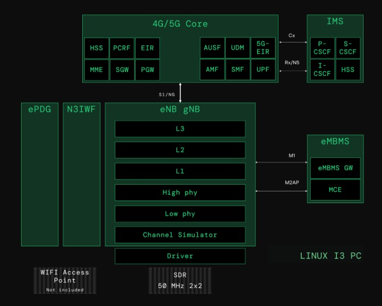
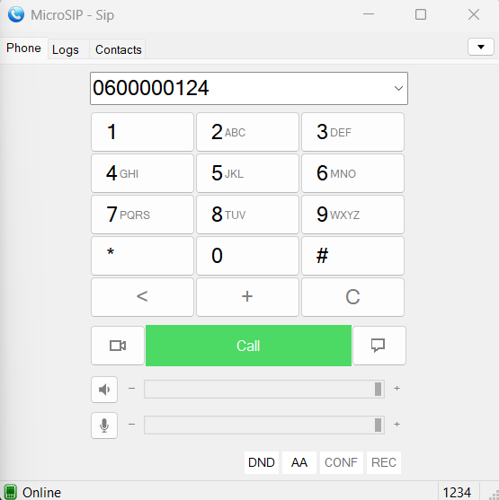
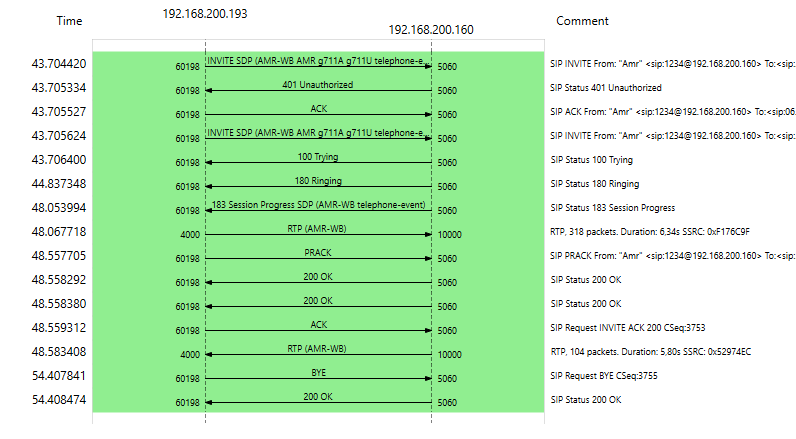
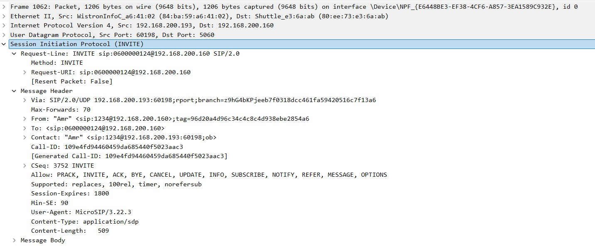
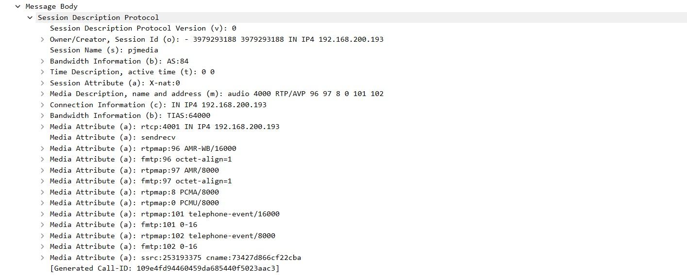
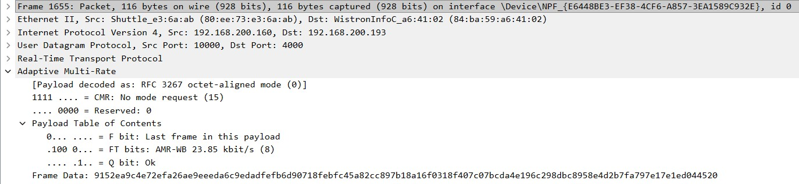
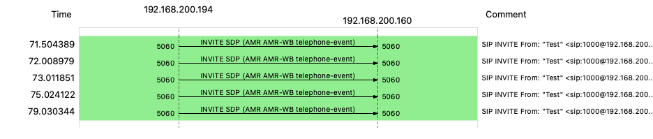
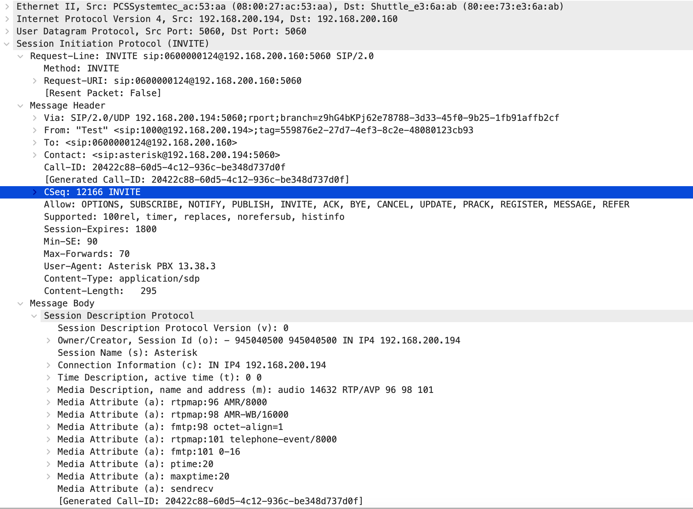

# SSMTK_FMC_VoNR_IMS_5G
<table>
<tr>
  <th><b>Predmet</b></th>
  <td>Sistemi i servisi mobilnih telekomunikacija</td>
</tr>
<tr>
  <th><b>Akademska godina</b></th>
  <td>2025/2026</td>
</tr>
<tr>
  <th><b>Projektni zadatak</b></th>
  <td>Fiksno-mobilna konvergencija govorne usluge u 5G mreži</td>
</tr>
<tr>
  <th><b>Opis projektnog zadatka</b></th>
  <td>Dizajn i implementacija fiksno-mobilne konvergencije (FMC) koja povezuje VoNR u 5G mreži sa IMS/SIP govornom uslugom u fiksnoj mreži, kroz više scenarija IMS jezgra.</td>
</tr>
<tr>
  <th><b>Tim</b></th>
  <td align="left">
    <table>
      <tr>
        <th><b>Član tima</b></th>
        <th colspan="2"><b><a href="#radni-paketi">Alocirani radni paketi</a></b></th>
      </tr>
      <tr>
        <td>Zakira Jašarević</td>
        <td>RP1</td>
        <td>RP5</td>
      </tr>
      <tr>
        <td>Lejla Porobić</td>
        <td>RP1</td>
        <td>RP4</td>
      </tr>
      <tr>
      <td>
        Amr Saračević</td>
        <td>RP2</td>
        <td>RP3</td>
      </tr>
      <tr>
        <td>Emina Hasković</td>
        <td>RP3</td>
        <td>RP5</td>
      </tr>
      <tr>
        <td>Merjema Varupa</td>
        <td>RP4</td>
        <td>RP6</td>
      </tr>
      <tr>
        <td>Muhamed Crnčalo</td>
        <td>RP2</td>
        <td>RP5</td>
      </tr>
    </table>
  </td>
</tr>
</table>

# Teorijski uvod
Ovaj projekat se bavi dizajnom i praktičnom implementacijom fiksno-mobilne konvergencije (FMC) govorne usluge, gdje se VoNR (Voice over New Radio) u 5G mreži povezuje sa IMS/SIP baziranom govornom uslugom u fiksnoj mreži. Cilj je razumjeti i demonstrirati kako se govorni pozivi uspostavljaju kroz različite arhitekturne scenarije IMS jezgra, te kako se signalizacija i medijski tok ponašaju u realnom test okruženju.

## Definicija FMC-a i njegova važnost
Široka rasprostranjenost širokopojasnih bežičnih tehnologija otvorila je novo razdoblje konvergencije, u kojem se različiti bežični uređaji i pristupne tehnologije koriste za pristup velikom broju usluga. Ova konvergencija, poznata kao fiksno-mobilna konvergencija (FMC), podrazumijeva objedinjavanje bežičnih i žičnih govornih, video i širokopojasnih podatkovnih usluga kroz njihovu neometanu integraciju u jedinstvenu mrežnu cjelinu.[^1]. Dakle, FMC označava integraciju fiksnih i mobilnih servisa tako da korisnik dobije jedinstveno iskustvo, bez obzira da li pristupa kroz mobilnu (5G) ili fiksnu mrežu. U praksi, FMC se često realizuje kroz IMS (IP Multimedia Subsystem) kao servisni sloj za govor (i druge real-time usluge), uz SIP signalizaciju i RTP/RTCP.

## VoNR u 5G SA mreži – osnovni koncept
Voice over New Radio (VoNR) predstavlja proces enkapsulacije govora preko Internet protokola (VoIP) koristeći 5G radio-pristupnu i jezgrenu mrežnu arhitekturu. Time se omogućava prijenos medijskih komponenti preko novog radio-interfejsa, odnosno 5G mreže. Jednostavnije rečeno, VoNR obezbjeđuje govorne usluge u 5G samostalnim (standalone) mrežama.[^2]
I VoLTE i VoNR koriste IP Multimedia Subsystem (IMS), koji omogućava integraciju paketno baziranih poziva u mrežnu infrastrukturu, pri čemu je mobilna mreža izvor komunikacije. Razlika između VoLTE i VoNR leži u osnovnoj mobilnoj mreži i radio arhitekturi na kojoj su zasnovani. Voice over New Radio (VoNR) pretvara telefonske pozive u podatkovne pakete, koji se zatim prenose putem 5G mreže i IMS sistema.

Tipičan tok je:
- UE se registruje u 5GC (NAS/NGAP),
- uspostavlja se PDU sesija (user plane preko UPF),
- UE se zatim registruje na IMS (SIP REGISTER preko P-CSCF),
- poziv se uspostavlja SIP porukama (INVITE/180/200/ACK),
- govor ide preko RTP (medijski tok), uz QoS politike i prioritet govora.

## IMS i SIP uloga u govornoj usluzi
IMS je arhitekturni okvir koji omogućava operaterima da pružaju govor kroz IP (multimedijalne) servise. Ključne IMS komponente (konceptualno) uključuju:
- P-CSCF predstavlja prvu SIP tačku za krajnjeg korisnika (mobilni UE ili fiksni SIP klijent), te terminira SIP signalizaciju, primjenjuje sigurnosne politike, inicira autentifikaciju i prosljeđuje poruke dalje unutar IMS jezgra,
- I-CSCF je ulazna tačka IMS domene koja služi za pronalaženje odgovarajućeg S-CSCF čvora i komunicira sa pretplatničkom bazom radi određivanja servisne logike za datog korisnika,
- S-CSCF je centralni kontrolni čvor IMS-a koji upravlja registracijama korisnika, održava SIP sesije i primjenjuje servisna pravila. S-CSCF je odgovoran za rutiranje poziva i interakciju sa aplikacijskim serverima,
- Pretplatnička baza koja sadrži identitete korisnika (IMPU/IMPI), autentifikacione podatke, dozvoljene servise i profil pretplatnika,
- Aplikacijski serveri (AS) implementiraju dodatnu servisnu logiku, poput upravljanja pozivima, FMC funkcionalnosti, preusmjeravanja, govorne pošte i sličnih usluga.

IP Multimedia Subsystem (IMS) predstavlja standardizirani arhitekturalni okvir koji omogućava pružanje multimedijalnih servisa, prvenstveno govorne usluge, preko IP mreža. IMS odvaja servisni sloj od pristupne mreže, čime omogućava da se isti govorni servisi koriste nezavisno od tehnologije pristupa (5G, LTE, fiksni pristup). U kontekstu VoNR i fiksno-mobilne konvergencije, IMS ima centralnu ulogu u upravljanju signalizacijom, autentifikacijom korisnika, rutiranjem poziva i primjenom servisne logike.

Session Initiation Protocol (SIP) je osnovni signalizacijski protokol koji se koristi unutar IMS arhitekture za registraciju korisnika, uspostavu, održavanje i prekid govornog poziva, te razmjenu informacija o medijskim parametrima (kodeci, portovi, transport).

SIP je tekstualni protokol aplikacijskog sloja koji funkcioniše po principu zahtjev–odgovor, pri čemu se ključne faze govornog poziva realizuju kroz poruke poput REGISTER, INVITE, ACK, BYE i odgovore tipa 401 Unauthorized, 180 Ringing i 200 OK. Informacije o govornom toku ne prenose se direktno kroz SIP, već se u SIP porukama koristi SDP (Session Description Protocol) kojim se pregovaraju parametri medijskog prenosa (npr. AMR/AMR-WB kodeci).

U VoNR scenariju, IMS omogućava da se govorna usluga realizuje isključivo unutar 5G mreže, dok se kod fiksno-mobilne konvergencije isti IMS servisni sloj koristi za opsluživanje i mobilnih i fiksnih korisnika. SIP signalizacija osigurava pravilnu kontrolu poziva, dok se sam govorni saobraćaj prenosi putem RTP/SRTP protokola, uz QoS mehanizme koje IMS i mreža zajednički primjenjuju.

Na ovaj način, IMS i SIP zajedno čine osnovu za realizaciju savremene govorne usluge u 5G i FMC okruženju.

## Scenariji koji se analiziraju
U projektu se razmatraju tri realna scenarija organizacije IMS jezgra:
- Zajedničko IMS jezgro u 5G mreži: IMS je “u mobilnoj domeni”, a fiksna mreža se veže kao SIP/IMS interkonekcija.
- Zajedničko IMS jezgro u fiksnoj mreži: 5G mreža koristi zajedničko IMS jezgro koje je smješteno u fiksnoj domeni.
- Odvojena IMS jezgra (5G IMS i fiksni IMS): Mobilna i fiksna mreža imaju svoje IMS sisteme, koji se povezuju preko SIP peering / interkonekcije, uz definisana pravila routinga i autentifikacije.

U praktičnom dijelu projekta fokus je na implementaciji i mjerenjima za scenarije (1) i (3), uz poređenje signalizacije i ponašanja sistema.

# RP1: Dizajn koncepta fiksno-mobilne konvergencije (FMC)
U okviru RP1 modelirana su tri arhitekturalna scenarija organizacije IMS jezgra u kontekstu fiksno-mobilne konvergencije (FMC) govorne usluge. Ovaj radni paket ima konceptualni i teorijski karakter, te služi kao osnova za razumijevanje arhitekture i odnosa između mrežnih elemenata u FMC okruženju.

U svim razmatranim scenarijima razlikuju se pristupni domeni — 5G mobilna mreža i fiksna pristupna mreža — dok se govorna usluga u potpunosti realizuje preko zajedničkog IMS/SIP servisnog sloja. Ključna razlika između scenarija ogleda se u tome gdje se IMS jezgro fizički i/ili logički nalazi, kao i u načinu na koji su mobilni i fiksni korisnici međusobno povezani kroz IMS infrastrukturu.

Važno je naglasiti da RP1 ne obuhvata konkretnu implementaciju, već predstavlja teorijski dizajn FMC arhitekture, uključujući identifikaciju relevantnih mrežnih čvorova, interfejsa i signalizacijskih tokova. Praktična realizacija odabranih scenarija, zajedno sa konfiguracijom sistema, eksperimentalnim testovima i analizom signalizacije, detaljno je obrađena u narednim radnim paketima (RP2–RP5).

---

### Zajednički elementi arhitekture
#### 5G mobilna mreža
- **5G UE (VoNR telefon)** – 5G pametni telefon koji podržava VoNR i sadrži IMS parametre (APN za IMS, SIP domen).  
- **gNB** – 5G bazna stanica koja obezbjeđuje radio pristup i prosljeđuje saobraćaj prema 5G Core-u.  
- **5G Core (AMF/SMF/UPF)**  
  - **AMF** – upravlja pristupom i mobilnošću UE-a (NAS signalizacija, registracija).  
  - **SMF** – upravlja PDU sesijama, IP adresama i QoS parametrima.  
  - **UPF** – provodi korisnički saobraćaj (SIP/RTP) između 5G RAN-a i servisnih platformi (IMS, Internet itd.).

#### IMS jezgro (logičke funkcije)
U zavisnosti od scenarija, IMS jezgro je smješteno u 5G ili u fiksnoj mreži, ili postoje dva odvojena IMS domena. U svim slučajevima IMS obuhvata:
- **P-CSCF** – prvi kontakt za SIP signalizaciju iz mreže.  
- **I-CSCF** – ulazna tačka IMS domena, bira odgovarajući S-CSCF.  
- **S-CSCF** – centralni SIP server koji održava registracije i sesije korisnika te primjenjuje servisna pravila.  
- **AS (Application Servers)** – aplikacijski serveri za dodatne usluge (FMC logika, istovremeno zvonjenje, voicemail itd.).  
- **HSS/UDM** – pretplatnička baza sa profilima mobilnih i fiksnih korisnika (brojevi, identiteti, servisi).

Glavna komponenta za izvedbu projekta jeste Amarisoft CallBox mini bazna stanica, čija je arhitektura prikazana na narednoj slici. Dodatno, korišten je mobilni uređaj koji podržava 5G tehnologiju.

<div align="center">
  
  <br>
  <i>Slika 1: Arhitektura Amarisoft CallBox mini bazne stanice</i>
</div>

---

#### Fiksna mreža
- **SIP telefon / Softphone** – krajnji uređaj fiksnog korisnika (IP telefon ili softphone).  
- **CPE / Home router** – kućni ruter koji pruža lokalnu IP konekciju prema operatoru (NAT, osnovni QoS).  
- **Fiksna pristupna tačka (xDSL/FTTH)** – pristupni segment koji povezuje CPE sa mrežom operatora.  
- **AGF / BNG (Fixed Access Gateway)** – agregacioni čvor koji terminiše sesije fiksnih korisnika, obavlja IP agregaciju i QoS te usmjerava SIP/RTP saobraćaj prema IMS-u.

---

### Scenarij (1): Zajedničko IMS jezgro u 5G mreži
U prvom scenariju IMS jezgro je smješteno u **mobilnoj (5G) domeni** i koristi se kao zajednička platforma za VoNR i fiksnu govornu uslugu.

**Tok poziva (primjer 5G UE → fiksni SIP korisnik):**
- 5G UE se registruje u 5GC i uspostavlja PDU sesiju prema IMS APN-u, zatim se registruje na IMS (SIP `REGISTER` preko P-CSCF-a).  
- Fiksni SIP telefon se, preko CPE-a i AGF/BNG-a, registruje na isto IMS jezgro.  
- Pri uspostavi poziva, SIP `INVITE` sa 5G UE prolazi kroz 5GC do IMS-a, gdje S-CSCF pronalazi registraciju fiksnog korisnika i prosljeđuje poziv prema fiksnoj mreži.  
- RTP tok nakon uspostave sesije prati put:
  - `5G UE -> gNB -> UPF -> IP jezgro -> AGF/BNG -> CPE -> SIP telefon`.

Ovaj scenarij naglašava FMC u kojem je **5G mreža domicilna za IMS**, a fiksna mreža ulazi kao dodatni pristupni domen.

<div align="center">
  
  <br>
  <i>Slika 2: Zajedničko IMS jezgro u 5G mreži</i>
</div>

---

### Scenarij (2): Zajedničko IMS jezgro u fiksnoj mreži
U drugom scenariju IMS jezgro je i dalje zajedničko za mobilne i fiksne korisnike, ali je **smješteno u fiksnoj mreži**. 5G domen koristi IMS fiksnog operatora za pružanje VoNR usluge.

**Tok poziva (5G UE → fiksni SIP korisnik):**
- 5G UE se registruje u 5GC, zatim šalje SIP `REGISTER` ka IMS-u u fiksnoj mreži.  
- Fiksni SIP telefon se registruje lokalno na isto IMS jezgro u fiksnoj mreži.  
- SIP `INVITE` sa 5G UE ide: `UE → gNB → 5GC → IMS P-CSCF (u fiksnoj mreži) → S-CSCF`, koji zatim poziv prosljeđuje prema registraciji fiksnog korisnika.  
- Media saobraćaj teče preko IP jezgra prema fiksnoj strani.

Ovaj scenarij odgovara situaciji u kojoj **fiksni IMS postoji kao centralna platforma**, a 5G mreža ga koristi kao servisni sloj za govor.

<div align="center">
  
  <br>
  <i>Slika 3: Zajedničko IMS jezgro u fiksnoj mreži</i>
</div>

---

### Scenarij (3): Odvojena IMS jezgra za 5G i fiksnu mrežu
Treći scenarij predstavlja pristup u kojem 5G i fiksna mreža imaju **dva odvojena IMS domena**, sa zasebnim pretplatničkim bazama i servisnim logikama. Između ova dva IMS sistema uspostavljen je SIP trunk.

**Tok poziva (5G UE → fiksni SIP korisnik):**

- 5G UE je registrovan na IMS-5G, a fiksni SIP telefon na IMS-F; svaki koristi vlastitu pretplatničku bazu i servisni profil.  
- SIP `INVITE` sa 5G UE ide prema S-CSCF-5G, koji na osnovu broja ili domene prepoznaje da se pozvani korisnik nalazi u fiksnoj IMS mreži.  
- Poziv se preusmjerava preko SIP trunk veze: `IMS-5G → IMS-F`, gdje S-CSCF-F pronalazi registraciju fiksnog korisnika i dostavlja poziv do SIP telefona.  
- Media saobraćaj se uspostavlja direktno između domena ili preko media gateway-a, u zavisnosti od konfiguracije trunk-a i eventualnog transkodiranja.

U ovom scenariju konvergencija se ostvaruje **na nivou interkonekcije dva IMS sistema**, a ne kroz jedno zajedničko jezgro, što omogućava veću nezavisnost domena, ali i kompleksnije upravljanje routiranjem i politikama.

<div align="center">
  
  <br>
  <i>Slika 4: Odvojena IMS jezgra za 5G i fiksnu mrežu</i>
</div>

---

# RP2: Implementacija VoNR usluge korištenjem AMARI Callbox Mini rješenja i 5G mobilnih telefona
U okviru ovog radnog paketa realizovana je implementacija i verifikacija Voice over New Radio (VoNR) usluge u 5G mreži, koristeći AMARI Callbox Mini kao baznu stanicu i jezgro mreže, te komercijalni 5G mobilni telefone kao krajnji korisnički uređaj. Cilj RP2 bio je uspostaviti funkcionalnu govornu uslugu isključivo unutar 5G arhitekture, bez oslanjanja na LTE fallback mehanizme, čime se demonstrira puna podrška za nativni 5G voice servis.

### Uspostava 5G 
Prelazak na 5G vrši se pozivom sljedećih naredbi kao root unutar foldera /enb:

```shell
ln -sfn gnb-sa.cfg enb.cfg
service lte start
```

Mobilni uređaj je uspješno registrovan na baznu stanicu i ostvarena je 5G (NR) konekcija, što je potvrđeno statusom mreže na uređaju. Tokom testiranja, uređaj je radio u 5G režimu sa stabilnim radio linkom.

### Verifikacija podatkovne konekcije
Izvršeno je mjerenje performansi mreže. Ostvarene su stabilne vrijednosti download i upload brzine, uz prihvatljive vrijednosti kašnjenja i jittera, bez detektovanog gubitka paketa. Ovi rezultati potvrđuju ispravnu uspostavu podatkovnog prenosa preko 5G mreže.

<div align="center">
  
  <br>
  <i>Slika 5: Verifikacija podatkovne konekcije</i>
</div>

---

### Uspostava poziva sa AMARI Callbox Mini ka mobilnom UE
Nakon uspješne registracije mobilnog uređaja na 5G mrežu i IMS, poziv je iniciran direktno sa strane AMARI Callbox Mini sistema.

U terminalu je prvo pozicioniranje izvršeno unutar direktorija:

```
cd /enb
```

Zatim je pristupljeno aktivnoj screen sesiji u kojoj je pokrenut LTE/5G stack:

```
screen -x lte
```

Ovom naredbom se otvara interaktivni multi-panelni screen interfejs AMARI sistema, koji sadrži više virtuelnih prozora (panela) za nadzor i upravljanje različitim komponentama sistema (gNB/eNB, 5G Core, IMS, sistemski logovi). Unutar screen interfejsa, izvršen je prelazak na IMS panel korištenjem sljedeće kombinacije tipki **Ctrl + a + 3**. Panel sa indeksom 3 predstavlja IMS kontrolni interfejs, koji omogućava upravljanje IMS funkcijama i iniciranje poziva. Nakon što je IMS panel aktivan, poziv je iniciran sljedećom naredbom:

```
mt_call 0600000124
```
Ova komanda pokreće mobilno-terminirani poziv (Mobile Terminated Call) prema navedenom broju, koristeći IMS/VoNR servisni sloj. Poziv je iniciran i održan bez prekida, što ukazuje na pravilno funkcionisanje mrežne infrastrukture i povezanih servisa.

<div align="center">
  
  <br>
  <i>Slika 6: Uspostava poziva</i>
</div>

---

### Snimanje mrežnog saobraćaja upotrebom Wireshark alata za VoNR u 5G mreži
Tokom testiranja uspostave VoNR poziva izvršeno je snimanje mrežnog saobraćaja u .pcap formatu radi kasnije analize signalizacijskih i transportnih tokova. Snimanje je realizovano korištenjem alata `tcpdump`, na relevantnom mrežnom interfejsu AMARI sistema, u realnom vremenu. 

```
tcpdump -i lo -w /root/capture/rp2_snimak.pcap
```

Dobijeni .pcap fajl sadrži:
- SCTP saobraćaj (NGAP signalizacija između gNB i 5GC),
- GTP tunelovani saobraćaj (korisnički i kontrolni tokovi),
- heartbeat poruke koje potvrđuju aktivne i stabilne veze između mrežnih elemenata.
  
Signalizacijski i govorni tokovi u VoNR scenariju su kriptovani:
- IMS signalizacija koristi SIP over TLS,
- govorni tok koristi SRTP.
Zbog toga sadržaj SIP poruka i audio signala nije direktno vidljiv u Wiresharku, dok su dostupni meta-podaci (protokoli, vremenski odnosi, redoslijed paketa), što odgovara realnim operativnim 5G mrežama.

<div align="center">
  
  <br>
  <i>Slika 7: Snimanje mrežnog saobraćaja u Wireshark alatu za VoNR u 5G mreži</i>
</div>

---

# RP3: Implementacija FMC za scenarij (1) – zajedničko IMS jezgro u 5G mreži
U okviru RP3 realizovan je FMC scenarij (1), u kojem se zajedničko IMS jezgro nalazi u 5G mreži (AMARI Callbox Mini) i istovremeno opslužuje:
- 5G VoNR korisnika (mobilni UE),
- fiksnog SIP korisnika (MicroSIP client na PC-u).
Cilj ovog radnog paketa je bio uspostaviti i verifikovati istovremenu IMS registraciju mobilnog i fiksnog korisnika na istom IMS jezgru, što predstavlja osnovni preduslov za fiksno-mobilnu konvergenciju govorne usluge.

### Fiksni SIP korisnik – MicroSIP
Kao fiksni korisnički terminal korišten je MicroSIP (v3.22.3) softphone, instaliran na računaru u IP mreži povezanoj sa IMS jezgrom AMARI Callbox Mini sistema. MicroSIP je u ovom scenariju predstavljao fiksnog korisnika FMC sistema, dok je mobilni korisnik realizovan kao VoNR UE u 5G mreži.

MicroSIP je konfigurisan tako da se registruje na isto IMS jezgro koje koristi VoNR mobilni korisnik i korišteni su sljedeći parametri:

- SIP server / Registrar: 192.168.200.160
- SIP domena: ims.mnc001.mcc001.3gppnetwork.org
- SIP korisnik (IMPU): sip:1234@ims.mnc001.mcc001.3gppnetwork.org
- Auth ID (IMPI): sipclient
- Password: sipclient
- Transport: UDP

<div align="center">
  
  <br>
  <i>Slika 8: Konfiguracija MicroSIP klijenta na isto IMS jezgro koje koristi VoNR mobilni korisnik</i>
</div>

---

Lokalni port je dinamički, dodijeljen od strane klijenta. Ova konfiguracija odgovara SIP korisniku definisanom u IMS bazi (_ue_db-ims.cfg_) i koristi standardni SIP Digest (MD5) autentifikacioni mehanizam.

Nakon pokretanja MicroSIP-a, izvršena je uspješna SIP registracija na IMS jezgro. Registracija je realizovana kroz standardni SIP tok:

- REGISTER
- 401 Unauthorized (Digest izazov)
- REGISTER (sa Authorization headerom)
- 200 OK

Fiksni SIP korisnik je, također, definisan u datoteci _ue_db-ims.cfg_ kao standardni IMS/SIP korisnik sa Digest (MD5) autentifikacijom.

```
{
  /* Dummy SIM information */
  sim_algo: "xor",
  imsi: "000000000000000",
  K: "00000000000000000000000000000000",
  amf: 0x0000,

  /* SIP user for FMC */
  impi: "sipclient",
  impu: [
    "sip:1234@ims.mnc001.mcc001.3gppnetwork.org",
    "tel:1234"
  ],
  pwd: "sipclient",
  authent_type: "MD5"
},
```

Ovim su definisani IMPI privatni identitet za autentifikaciju (sipclient) i IMPU – javni identiteti (SIP URI i telefonski broj), te autentifikacija kao standardni SIP Digest (MD5).

Nakon izmjena konfiguracije, IMS i LTE servisi su restartovani, što se podrazumijeva pri svakoj izmjeni konfiguracijskih fajlova:

```shell
service lte stop
service lte start
```

U IMS CLI izlazu ((ims) users) prikazanom na _Slici 8_ MicroSIP korisnik je vidljiv kao registrovan SIP korisnik sa aktivnim SIP bindingom, uključujući IP adresu računara i dodijeljeni lokalni port. Ovim je potvrđeno da MicroSIP ispravno komunicira sa IMS jezgrom i da je spreman za uspostavu FMC poziva.

### Konfiguracija IMS servisa - Callbox Mini
IMS servis je konfigurisan kroz datoteku _ims.cfg_. Ključne postavke uključuju SIP bind adrese, rad u 3GPP režimu i učitavanje baze IMS korisnika.

```
sip_addr: [
  {addr: "192.168.200.160", bind_addr: "192.168.200.160", port_min: 10000, port_max: 20000, trunk: false},
  "2001:468:3000:1::"
],

/* Global domain name */
domain: "amarisoft.com",

/* IMS user database */
include "ue_db-ims.cfg",

/* 3GPP IMS mode */
precondition: true,

/* IPSec algorithms */
ipsec_aalg_list: ["hmac-md5-96", "hmac-sha-1-96"],
ipsec_ealg_list: ["null", "aes-cbc", "des-cbc", "des-ede3-cbc"],
```

Također, za uspješnu uspostavu govornog poziva između MicroSIP klijenta i VoNR mobilnog telefona unutar istog IMS jezgra, bilo je neophodno koristiti 3GPP preconditions mehanizam. U 3GPP IMS/VoLTE/VoNR okruženju, preduslovi (engl. preconditions) služe da se prije prihvatanja poziva potvrdi da su resursi rezervisani, QoS politika primijenjena, te medijski tok pripremljen za govor. U praksi to znači da IMS u 3GPP režimu očekuje da krajnji korisnici (ili barem relevantni identiteti) budu označeni kao korisnici koji podržavaju preconditions. Bez toga može doći do situacije da SIP signalizacija krene ispravno, ali se poziv ne uspostavi korektno (npr. ne prođe offer/answer faza kako IMS očekuje) ili se sesija prekine zbog neusaglašenih zahtjeva prema QoS preduslovima. Zbog toga je osim globalnog podešavanja _precondition: true_ u _ims.cfg_ bilo potrebno uključiti preconditions i na nivou korisničkog identiteta unutar datotetke _ue_db-ims.cfg_ na način:

```
impu: [
      "001010123456789",
      { impu: "tel:0600000124", imei: "867786040633402", precondition: "on" },
      ]
```

Na taj način IMS tretira taj identitet kao 3GPP korisnika koji podržava preconditions, što je bilo potrebno da poziv MicroSIP → VoNR UE bude uspješno uspostavljen u zajedničkom IMS jezgru.

### Verifikacija FMC scenarija (1)
Uspješna realizacija RP3 potvrđena je komandom:

```shell
(ims) users
```

Rezultat prikazuje istovremeno registrovane VoNR mobilnog korisnika (IMS + IPSec, 3GPP) i fiksnog SIP korisnika (sipclient) sa PC-a.

<div align="center">
  
  <br>
  <i>Slika 9: Izlaz komande <code>(ims) users</code>. Prikazan je VoNR korisnik registrovan uz IPSec zaštitu (gornji dio) i standardni SIP korisnik <code>sipclient</code> registrovan sa PC-a (donji dio). Ovo potvrđuje da oba korisnika koriste isto IMS jezgro </i>
</div>

---

Nakon uspješne IMS registracije oba korisnika, izvršena je uspostava FMC govornog poziva iniciranog sa fiksnog SIP klijenta (MicroSIP) prema mobilnom VoNR korisniku. Poziv je rutiran kroz zajedničko IMS jezgro u 5G mreži.

<div align="center"> 
  <table> 
    <tr> 
      <td align="center" width="50%"> 
        
        <br>
        <i>Slika 10a: Iniciranje FMC poziva sa fiksnog SIP klijenta (MicroSIP) prema mobilnom korisniku <code>0600000124</code>.</i>
      </td> 
      <td align="center" width="50%"> 
        
        <br>
        <i>Slika 10b: Dolazni i aktivni FMC govorni poziv na VoNR mobilnom uređaju, sa prikazanim identitetom pozivaoca <code>SIP korisnik RP3</code> i trajanjem poziva.</i>
      </td> 
  </tr> 
  </table> 
</div>

Uspješna uspostava i održavanje poziva potvrđuju ispravnu IMS registraciju fiksnog i mobilnog korisnika, korektno SIP rutiranje kroz zajedničko IMS jezgro, te funkcionalan govorni (medijski) tok između fiksne i mobilne mreže.

---

# RP4 – Implementacija FMC za scenarij (3): odvojena IMS jezgra 5G i fiksne mreže
U okviru RP4 realizovan je FMC scenarij (3), u kojem 5G mreža i fiksna mreža imaju odvojena IMS jezgra, a međusobna komunikacija ostvarena je putem SIP trunk veze. U ovom scenariju, Asterisk se koristi kao SIP gateway / interkonekcijski čvor između fiksne SIP mreže i IMS jezgra u 5G mreži (AMARI Callbox Mini). Cilj ovog radnog paketa je demonstrirati FMC konvergenciju na nivou interkonekcije dva odvojena IMS domena, što predstavlja realističan operaterski scenarij.

## Arhitektura rješenja
U realizovanom rješenju učestvuju sljedeći elementi:
- 5G IMS jezgro (AMARI Callbox Mini) - opslužuje VoNR mobilne korisnike, implementira 3GPP IMS funkcije, te omogućava SIP trunk konekciju prema eksternoj SIP mreži;
- Asterisk SIP server (fiksna mreža) - predstavlja IMS/fiksni SIP domen,terminira fiksne SIP korisnike, te realizuje SIP trunk prema IMS jezgru u 5G mreži;
- Fiksni SIP klijent (Microsip) - registrovan na Asterisk, te predstavlja fiksnog korisnika FMC sistema;
- VoNR mobilni korisnik (UE) - registrovan na IMS jezgro 5G mreže, te ostvaruje govornu uslugu preko VoNR-a.

## Dodavanje SIP trunk-a u IMS (AMARI Callbox Mini)
Prvi korak u realizaciji RP4 bio je dodavanje SIP trunk veze u IMS konfiguraciju AMARI Callbox Mini sistema, u skladu sa zvaničnom Amarisoft dokumentacijom [^3]. SIP trunk je definisan u datoteci _ims.cfg_ na sljedeći način:

```
sip_addr: [
        {addr: "192.168.200.160", bind_addr: "192.168.200.160", port_min: 10000, port_max: 20000, trunk: true},
        "2001:468:3000:1::"
],

trunk: {
           addr: "192.168.200.194", // SIP server IP address
           name: "amarisoft", // SIP account username, used for contact/from headers
},
```

Prethodnim je IMS jezgru omogućeno da prihvata SIP pozive iz eksternog SIP domena (Asterisk), rutira pozive prema VoNR korisnicima, te šalje odlazne pozive iz IMS-a prema fiksnoj SIP mreži.

Ovim je IMS jezgro logički pripremljeno za inter-IMS komunikaciju, iako fizički IMS sistemi ostaju odvojeni.

  
## Asterisk - izbor i priprema sistema 
Za realizaciju ovog dijela projekta korišten je Asterisk. Asterisk je open-source okvir za izgradnju komunikacijskih aplikacija koji pretvara računar u komunikacijski server [^4].

Podrazumijevana verzija Asteriska ne podržava AMR (Adaptive Multi-Rate) kodek. To predstavlja ograničenje u scenarijima gdje se koriste SIP/IMS klijenti koji rade sa AMR kodekom, kao što je MicroSIP, koji AMR podršku ima implementiranu i aktivno je koristi prilikom SIP pregovaranja kodeka (SDP).

Zbog toga je u sistemu dolazilo do nekompatibilnosti kodeka i neuspješnog uspostavljanja poziva između SIP klijenta i Asterisk jezgra. 

Shodno ranije navedenom, u okviru projekta bilo je potrebno omogućiti interoperabilnost između AMR-capable SIP klijenata (MicroSIP) i Asterisk jezgra, pravilno SIP/SDP pregovaranje kodeka, te uspješno uspostavljanje govornih poziva u IMS/FMC testnom okruženju. Kako Asterisk ne nudi nativnu AMR podršku, bilo je neophodno proširiti Asterisk dodatnim AMR kodek modulom.

AMR podrška je realizovana integracijom otvorenog (open-source) AMR modula za Asterisk, dostupnog na sljedećem repozitoriju: https://github.com/traud/asterisk-amr [^5].

Ovaj modul omogućava:

  - dodavanje AMR kodeka u Asterisk;
  - pravilno kodiranje i dekodiranje AMR govornog signala;
  - uspješno pregovaranje AMR kodeka u SIP/SDP razmjeni;
  - interoperabilnost sa SIP klijentima koji koriste AMR kodek (MicroSIP).

## Konfiguracija Asterisk-a - pjsip.conf
Datoteka pjsip.conf sadrži kompletnu SIP konfiguraciju Asterisk sistema i obuhvata:

- transportni sloj koji omogućava SIP komunikaciju preko UDP-a na standardnom portu 5060.

```
[transport-udp]
type=transport
protocol=udp
bind=0.0.0.0:5060
```

- fiksni SIP korisnik (ekstenzija 1000)

```
[1000]
type=endpoint
transport=transport-udp
context=internal
disallow=all
allow=amr
allow=amrwb
auth=1000-auth
aors=1000
direct_media=yes
```

Prethodnim se definiše SIP endpoint za fiksnog korisnika, dozvoljavaju AMR i AMR-WB kodeci, te se mapiraju korisnici u dialplan kontekst _internal_, koji će naknadno biti pojašnjen. Također, omogućena je autentifikacija korisnika na sljedeći način:

```
[1000-auth]
type=auth
auth_type=userpass
username=1000
password=1000
```

- IMS SIP trunk

```
[ims-aor]
type=aor
contact=sip:192.168.200.160:5060

[ims-endpoint]
type=endpoint
transport=transport-udp
aors=ims-aor
disallow=all
allow=amr
allow=amrwb
direct_media=yes
from_domain=ims.mnc001.mcc001.3gppnetwork.org
send_pai=yes
trust_id_inbound=yes
context=from-ims
```

Prethodnim se definiše SIP trunk prema IMS jezgri, omogućava razmjena identiteta, te se mapiraju dolazni pozivi iz IMS-a u kontekstu _from-ims._ Na kraju, definisana je identifikacija IMS-a po IP adresi na sljedeći način:

```
[ims-identify]
type=identify
endpoint=ims-endpoint
match=192.168.200.160
```

## Asterisk Dialplan konfiguracija - extensions.conf
Pored prethodnog, neophodno je implementirati dialplan logiku s ciljem da se omoguće outbound pozivi iz Asterisk-a prema IMS jezgru (pozivi ka mobilnim 06X brojevima) i inbound pozivi iz IMS jezgra prema lokalnom Asterisk korisniku (npr. SIP/PJSIP ekstenzija 1000).

Konfiguracija je organizovana u dva osnovna context-a:
- _internal_ – lokalni “dialplan” za interne ekstenzije i odlazne pozive ka IMS-u;
- _from-ims_ – obrada dolaznih poziva koji stižu sa IMS trunk-a u Asterisk.

### Context internal:  interne ekstenzije i odlazni pozivi ka IMS-u
Unutar konfiguracijske datoteke prvo je definisana test ekstenzija 1000 za lokalni poziv, te provjeru govornog (audio) kanala.

```
[internals]
exten => 1000,1,Answer()
 same => n,Playback(demo-congrats)
 same => n,Hangup()
```

Ova ekstenzija služi kao lokalna provjera osnovne Asterisk funkcionalnosti:
- Answer() prihvata poziv,
- Playback(demo-congrats) reproducira testni audio,
- Hangup() završava sesiju.

Dakle, prethodna ekstezija se koristi kao brza verifikacija da je endpoint registriran i da lokalni audio kanal funkcioniše bez IMS-a.

Za odlazne pozive prema IMS-u definisano je:

```
exten => _06X.,1,NoOp(Outgoing call to IMS: ${EXTEN})
 same => n,Dial(PJSIP/${EXTEN}@ims-endpoint,60)
 same => n,Hangup()
```

Ovaj dio dialplan-a omogućava da se svi brojevi koji odgovaraju šablonu _06X. (npr. 060...) automatski tretiraju kao pozivi ka IMS mreži.

### Context from-ims: dolazni pozivi iz IMS-a prema Asterisku

```
[from-ims]
exten => 1000,1,NoOp(Incoming call from IMS to 1000)
 same => n,Dial(PJSIP/1000,30)
 same => n,Hangup()
```

Ovaj context je namijenjen obradi poziva koji stižu sa IMS trunk-a prema Asterisku. Kada IMS pošalje INVITE prema Asterisku sa ciljem 1000, dialplan ispisuje dijagnostičku poruku (NoOp), zatim zvoni lokalni endpoint PJSIP/1000 do 30 sekundi, nakon čega se završava poziv.

Ovim se zatvara drugi smjer komunikacije (IMS → Asterisk), čiji je cilj omogućavanje da mobilni IMS korisnik može pozvati “fiksnog” korisnika/ekstenziju na Asterisku.

## Rezultat integracije
Nakon završene konfiguracije Asterisk sistema (PJSIP trunk, dialplan i kodeci), funkcionalnost sistema je analizirana kroz više testnih scenarija.

### Funkcionalnosti koje rade ispravno 
- Asterisk je uspješno instaliran i pokrenut sa podrškom za AMR i AMR-WB govorne kodeke.
- AMR kodek se ispravno pregovara i koristi tokom poziva, što je potvrđeno kroz SDP razmjenu i RTP tok.
- Sistem je time postao kompatibilan sa IMS okruženjem i mobilnim mrežama, u kojima je AMR standardni govorni kodek (VoLTE/VoNR).
- MicroSIP klijent se uspješno registruje na Asterisk (PJSIP endpoint).
- SIP trunk je definisan i aktivan.
- Sa Asterisk strane kompletan call-flow se izvršava korektno: INVITE se generiše, SIP dijalog se pravilno formira, te se zahtjev prosljeđuje prema IMS trunk-u.

Prethodno će detaljnije biti opisano kroz RP5.

### Identifikovani problem / ograničenje
Prilikom pokušaja uspostave poziva u smjeru MicroSIP → Asterisk → IMS → 5G VoNR UE uočeno je sljedeće ponašanje:
- Asterisk ispravno šalje SIP INVITE poruke prema IMS jezgru putem SIP trunk-a.
- INVITE poruke se ponavljaju (retransmisije), što je vidljivo u Wireshark snimcima, a koji će biti prikazani kroz RP5.
- IMS jezgro ne obrađuje dolazni INVITE - ne pojavljuje se u IMS logovima, ne stiže do bazne stanice, te se ne generiše SIP odgovor (niti 1xx, niti 4xx/5xx).

Drugim riječima, SIP signalizacija se završava na Asterisk strani, dok na IMS strani INVITE nikada ne biva procesuiran.

---

# RP5: Eksperimentalna analiza signalizacijskih tokova
## Analiza signalizacijskih tokova za scenarij (1)
U RP5 je analiziran snimljeni saobraćaj uspostave govornog poziva u FMC scenariju (1), gdje se zajedničko IMS jezgro nalazi u 5G mreži (AMARI Callbox Mini), a poziv se inicira sa fiksnog SIP klijenta (MicroSIP) prema mobilnom korisniku.

Analiza je izvedena na osnovu _.pcap_ datoteka i Wireshark prikaza:

- SIP signalizacije (INVITE/180/200/ACK/BYE…),
- MSC dijagrama (Message Sequence Chart) generisanog iz snimljenog saobraćaja,
- RTP medijskog toka i dekodiranog AMR-WB payload-a.

### Kreiranje MSC dijagrama u Wireshark-u
Snimanje saobraćaja na baznoj stanici (Callbox Mini) pohranjuje se u _.pcap_ datoteke. Komanda korištena za snimanje je **tcpdump** (snimanje paketa na mrežnom interfejsu). Budući da se _.pcap_ datoteke analiziraju u Wireshark-u, a Wireshark GUI nije moguće pokrenuti u terminalu bazne stanice, snimljene ._pcap_ datoteke je potrebno prebaciti na remote računar i otvoriti u Wireshark-u radi analize.

U Wireshark-u je snimljen saobraćaj uspostave VoLTE/IMS poziva. Jedna od prednosti Wireshark-a je mogućnost automatskog kreiranja MSC dijagrama iz VoIP signalizacije. MSC dijagram se generiše tako što se najprije otvori odgovarajuća _.pcap_ datoteka u alatu Wireshark. Nakon toga, iz glavnog menija se odabere opcija Telephony → VoIP Calls, čime se prikazuje lista detektovanih poziva. U otvorenom prozoru je potrebno označiti sve relevantne stavke koje pripadaju analiziranom pozivu, a zatim kliknuti na opciju Flow Sequence, čime se automatski generiše MSC dijagram toka signalizacije. 

<div align="center"> 
   
  <br> 
  <i>Slika 11: Prikaz VoIP Calls prozora u Wireshark-u sa označenim SIP pozivom, na osnovu kojeg je generisan MSC dijagram.</i>
</div>

---

MSC dijagram ilustruje proces uspostave, odvijanja i prekida VoLTE poziva, pri čemu se za signalizaciju koristi SIP (Session Initiation Protocol), dok je prenos govornih paketa realizovan putem RTP-a (Real-Time Transport Protocol). 

<div align="center"> 
   
  <br> 
  <i>Slika 12: MSC dijagram generisan u Wireshark-u (Telephony → VoIP Calls → Flow Sequence). Prikazan je tok SIP signalizacije i početak RTP medijskog toka između fiksnog SIP klijenta i IMS jezgra.</i>
  <span style="display:block"></span>
</div>

---

Iz MSC dijagrama i SIP paketa vidljiva su dva osnovna signalizacijska čvora:
- 192.168.200.193 – fiksni SIP klijent (MicroSIP, PC)
- 192.168.200.160 – IMS/SIP server (Callbox Mini / IMS jezgro)

SIP signalizacija se odvija preko UDP portova:
- MicroSIP koristi dinamički lokalni port (npr. 60198),
- IMS server sluša na standardnom SIP portu 5060.

U početnoj fazi, korisnički uređaj koji započinje poziv (MicroSIP klijent na IP adresi 192.168.200.193) šalje SIP INVITE poruku prema IMS jezgru (192.168.200.160). INVITE poruka sadrži SDP (Session Description Protocol), unutar kojeg su definisani podržani govorni kodeci, uključujući AMR-WB i AMR, parametri medijskog toka, te dodatne mogućnosti sistema, što će detaljnije biti obrađeno u narednoj sekciji.

INVITE poruka se dalje prosljeđuje kroz IMS mrežnu infrastrukturu, obuhvatajući funkcionalne IMS čvorove (npr. P-CSCF i S-CSCF), sve dok ne stigne do odredišnog korisnika, odnosno do mobilnog VoNR UE-a.

Po prijemu INVITE zahtjeva, IMS jezgro vraća odgovor 401 Unauthorized, koji predstavlja standardni SIP Digest izazov. Ovim odgovorom IMS ne odbija poziv, već zahtijeva autentifikaciju pozivajućeg korisnika korištenjem mehanizma koji omogućava sigurnu provjeru identiteta bez slanja lozinke u otvorenom obliku. MicroSIP potvrđuje prijem ovog odgovora porukom ACK.

Nakon toga, MicroSIP ponovo šalje INVITE poruku, ovaj put dopunjenu Authorization zaglavljem koje sadrži kriptografski izračunat odgovor (Digest/MD5) na prethodni izazov. Time klijent dokazuje svoj identitet i ispunjava sigurnosne zahtjeve IMS jezgra.

IMS zatim odgovara porukom 100 Trying, čime signalizira da je zahtjev ispravno zaprimljen i da je proces uspostave poziva u toku. Slijedi poruka 180 Ringing, kojom se označava da je pozvani korisnik obaviješten o dolaznom pozivu i da se nalazi u fazi zvonjenja.

U narednom koraku IMS šalje poruku 183 Session Progress, koja u ovom scenariju sadrži SDP i koristi se za rani napredak sesije (engl. early media). Ova poruka je povezana sa korištenjem pouzdanih privremenih odgovora (100rel), što je tipično ponašanje u IMS okruženju. Kako bi se osigurala pouzdana razmjena ovakvih privremenih odgovora, MicroSIP šalje poruku PRACK, kojom potvrđuje prijem 183 odgovora i omogućava kontrolisano fazno uspostavljanje sesije.

Nakon uspješne razmjene SDP parametara i ispunjenja svih preduslova, IMS šalje 200 OK kao finalni odgovor na INVITE zahtjev. MicroSIP potvrđuje ovaj odgovor slanjem završne ACK poruke, čime je SIP sesija zvanično uspostavljena.

Po završetku signalizacijske faze započinje medijski tok, koji se u MSC dijagramu vidi kao RTP saobraćaj sa AMR-WB kodekom. Prisustvo kontinuiranog RTP toka potvrđuje da je govor ispravno uspostavljen i da se audio prenosi u realnom vremenu između fiksnog SIP klijenta i mobilnog VoNR korisnika.

Prekid poziva realizovan je standardnim SIP mehanizmom: jedna strana šalje poruku BYE, a druga potvrđuje prekid sesije odgovorom 200 OK. Time je kompletiran puni SIP/RTP životni ciklus poziva – od inicijalnog INVITE zahtjeva, preko aktivnog govornog toka, do urednog zatvaranja sesije.

### Detaljna analiza INVITE poruke (SDP i ponuđeni kodeci)
U Wireshark prikazu INVITE paketa vidi se da MicroSIP koristi application/sdp.

<div align="center"> 
   
  <br> 
  <i>Slika 13: SIP <code>INVITE</code> poruka (MicroSIP/3.22.3) prema IMS serveru <code>192.168.200.160:5060</code>.</i> 
</div>

---

<div align="center"> 
   
  <br>
  <i>Slika 14: U INVITE poruci je prisutan SDP, kojim se nude medijski parametri i kodeci.</i> 
</div>

---

Iz MSC-a je vidljivo da SDP ponuda sadrži kodeke:
- AMR
- AMR-WB (wideband govor, tipično za VoLTE/VoNR),
- G.711 A-law (g711a),
- G.711 μ-law (g711u) (kompatibilni “fallback” kodeci),
- telephone-event (DTMF tonovi preko RTP-a).

IMS/VoLTE okruženja preferiraju AMR/AMR-WB zbog efikasnosti i standardizacije za mobilni govor, dok G.711 služi kao kompatibilna alternativa u nekim interworking scenarijima.

### RTP medijski tok i portovi
MSC prikazuje početak RTP toka označen kao RTP (AMR-WB). U prikazu je vidljivo da se RTP odvija između portova:
- MicroSIP strana: UDP 4000
- IMS strana: UDP 10000.

Ovo odgovara SDP pregovoru, SIP signalizacija dogovara RTP portove, nakon čega medijski tok teče direktno preko UDP/RTP.

Wireshark omogućava dekodiranje AMR-WB RTP payload-a. U priloženim primjerima payload je dekodiran kao RFC 3267 octet-aligned mode.

Na prikazanim slikame se može uočiti polje FT (Frame Type) koje definiše AMR-WB “mode” i time efektivnu bitrate vrijednost (kb/s):
- AMR-WB 15.85 kbit/s (FT = 4)
- AMR-WB 23.85 kbit/s (FT = 8).

<div align="center"> 
  <table> 
    <tr> 
      <td align="center" width="50%"> 
         
        <br> 
        <i>Slika 15a: RTP payload dekodiran kao AMR-WB (RFC 3267), primjer moda 15.85 kbit/s (FT=4).</i> 
      </td> 
      <td align="center" width="50%"> 
         
        <br> 
        <i>Slika 15b: RTP payload dekodiran kao AMR-WB (RFC 3267), primjer moda 23.85 kbit/s (FT=8).</i> 
      </td> 
    </tr> 
  </table> 
</div>

Ovim je eksperimentalno potvrđena ispravna realizacija FMC poziva u scenariju (1) na nivou signalizacije i medije.

## Analiza signalizacijskih tokova za scenarij (3)
Analogno prethodnoj proceduri, nakon snimanja Wireshark saobraćaja i za scenarij (3), kreiran je MSC dijagram prikazan na sljedećoj slici:

<div align="center"> 
   
  <br> 
  <i>Slika 16: MSC dijagram generisan u Wireshark-u za scenarij (3).</i>
</div>

---

MSC dijagram ilustruje pokušaj uspostave poziva u kojem:
- Asterisk (IP: 192.168.200.194) djeluje kao SIP gateway/trunk prema IMS jezgru
- IMS jezgro (IP: 192.168.200.160) predstavlja 5G IMS domen
- Poziv je iniciran iz fiksne SIP domene (MicroSIP → Asterisk)
- Signalizacija koristi SIP, dok je medijski prenos predviđen putem RTP

Za razliku od scenarija (1), u ovom slučaju ne dolazi do kompletne SIP razmjene, jer IMS jezgro ne prihvata dolazni INVITE zahtjev sa Asterisk strane.

Asterisk šalje SIP INVITE poruku prema IMS jezgru na port 5060. INVITE sadrži SDP tijelo sa definisanim medijskim parametrima: 
- IP adresa izvora: 192.168.200.194
- IP adresa odredišta (IMS): 192.168.200.160
- Transport: UDP
- User-Agent: Asterisk PBX 13.38.3

U SDP dijelu ponuđeni su kodeci AMR (8 kHz), AMR-WB (16 kHz) i telephone-event (DTMF preko RTP-a). Ova ponuda kodeka je u potpunosti kompatibilna sa IMS/VoLTE/VoNR okruženjem, gdje su AMR i AMR-WB standardni govorni kodeci.

### Ponovljeni INVITE zahtjevi
Na MSC dijagramu i u Wireshark listi paketa vidi se da Asterisk više puta šalje identičan INVITE prema IMS jezgru, u pravilnim vremenskim intervalima.

<div align="center">
  
  <br>
  <i>Slika 17: Višestruki SIP INVITE zahtjevi poslani sa Asterisk-a prema IMS jezgru</i>
</div>

---

Ovo ponašanje je u skladu sa SIP retransmission mehanizmom, koji se aktivira kada klijent ne dobije nikakav odgovor (ni 100 Trying, ni grešku). Ključni nalaz ove analize jeste činjenica da IMS ne vraća nikakav SIP odgovor, što je objašnjeno kroz ranija poglavlja.

### Analiza SDP i kodeka

Iako poziv nije uspostavljen, SDP analiza potvrđuje da je sa SIP/Asterisk strane sve korektno:
- AMR i AMR-WB su pravilno oglašeni
- Korišten je octet-align=1 (obavezno za IMS interoperabilnost)
- Ponuđen je ptime=20 ms, što odgovara IMS preporukama
- RTP port je validan i otvoren.

<div align="center">
  
  <br>
  <i>Slika 18: SDP analiza – AMR/AMR-WB kodeci ponuđeni prema IMS jezgru</i>
</div>

---

Sa tehničke strane SIP klijenta i Asterisk-a, ne postoji greška u kodecima niti u SDP strukturi.

# Zaključak 
U ovom projektu implementirane su i analizirane različite varijante fiksno-mobilne konvergencije (FMC) u kontekstu 5G IMS mreže, koristeći kombinaciju 5G VoNR, IMS jezgra i SIP/Asterisk sistema. Poseban fokus stavljen je na praktičnu realizaciju signalizacijskih tokova, interoperabilnost fiksnih i mobilnih korisnika, te ponašanje sistema u realnim mrežnim uslovima.

U scenariju u kojem se koristi zajedničko IMS jezgro, FMC arhitektura je demonstrirala potpunu funkcionalnost sistema. Uspješno su realizovane SIP registracije fiksnih i mobilnih korisnika, ispravno je provedeno SDP pregovaranje govornog kodeka (AMR/AMR-WB), te je ostvaren stabilan dvosmjerni RTP medijski tok. Analiza MSC dijagrama i snimljenog saobraćaja potvrđuje korektnu razmjenu signalizacijskih poruka (INVITE, 401, 183, PRACK, 200 OK, ACK, BYE), čime je potvrđena ispravna integracija fiksne i mobilne domene unutar istog IMS jezgra.

S druge strane, u scenariju sa odvojenim IMS domenama, gdje je Asterisk korišten kao SIP posrednik i trunk prema IMS jezgru, uočen je funkcionalni limit sistema. Iako Asterisk ispravno obrađuje poziv, generiše SIP INVITE zahtjeve i nudi odgovarajuće medijske parametre, signalizacija se zaustavlja na IMS strani, bez povratnog odgovora i bez dalje obrade zahtjeva. Ovo ponašanje ukazuje na ograničenja trenutne interkonekcije IMS procesa s generičkim SIP trunk-om i potrebu za dodatnom IMS/Proxy logikom ili specijaliziranim IMS interworking servisima.

Projekt jasno demonstrira praktične izazove fiksno-mobilne konvergencije u 5G IMS okruženju, ali istovremeno pokazuje i realne granice interoperabilnosti između IMS-specifičnih sistema i klasičnih SIP rješenja. Dobijeni rezultati pružaju uvid u razliku između teorijske FMC arhitekture i njene stvarne implementacije, te jasno identifikuju uslove pod kojima je FMC funkcionalna, kao i tačke na kojima su potrebna dodatna IMS-orijentisana rješenja i napredniji interworking mehanizmi.

---

<details id="radni-paketi">
<summary title="Kliknite za prikaz radnih paketa.">Radni paketi</summary>
<table>
  <tr>
    <td><b>Radni paket</b></td>
    <td><b>Opis</b></td>
  </tr>
  <tr>
    <td>RP1 - Dizajn koncepta FMC</td>
    <td>Dizajn koncepta fiksno-mobilne konvergencije (FMC) koji povezuje govornu uslugu u 5G mreži (VoNR) sa IMS/SIP baziranom govornom uslugom u fiksnoj mreži, a uključuje
različite scenarije: (1) IMS jezgro je zajedničko i nalazi se u 5G mreži, (2) IMS jezgro je zajedničko i nalazi se u fiksnoj mreži i (3) IMS jezgre 5G i fiksne mreže su odvojene.
    </td>
  </tr>
  <tr>
    <td>RP2 - Implementacija VoNR usluge</td>
    <td>Implementacija VoNR korištenjem AMARI Callbox Mini rješenja i 5G mobilnih telefona.</td>
  </tr>
  <tr>
    <td>RP3 - Implementacija FMC za scenarij (1)</td>
    <td>FMC za slučaj gdje je IMS jezgro zajedničko i nalazi se u 5G mreži.</td> 
    
  </tr>
  <tr>
    <td>RP4 - Implementacija FMC za scenarij (3)</td> 
    <td>FMC za slučaj gdje su IMS jezgra 5G i fiksne mreže odvojene.</td>
  </tr>
  <tr>
   <td>RP5 - Eksperimentalna analiza signalizacijskih tokova</td> 
   <td>Analiza signalizacijskih tokova za scenarije (1) i (3).</td> 
  </tr>
  <tr>
   <td>RP6 - Repozitorij i dokumentacija</td> 
    <td>
      Izrada projektne dokumentacija i održavanje GitHub repozitorija. 
    </td>
  </tr>
</table>
</details>

# Literatura:
[^1]: Raj, M., Narayan, A., Datta, S., Das, S. K., & Pathak, J. K. (2010). Fixed mobile convergence: challenges and solutions. IEEE Communications Magazine, 48(12), 26-34.
[^2]: What is Voice over New Radio (VoNR). NG-Voice <a href="https://www.ng-voice.com/learning-center/what-is-voice-over-new-radio-vonr#what-is-voice-over-new-radio-vonr">Link</a>.
[^3]: How to run VoLTE/VoNR call using a SIP trunk. Amarisoft Tech Academy. <a href="https://tech-academy.amarisoft.com/how_to_run_volte_call_using_a_sip_trunk.wiki">Link</a>.
[^4]: Getting Started with Asterisk. Sangoma Technologies. 2026. <a href="https://www.asterisk.org/get-started/">Link</a>.
[^5]: Asterisk patch for AMR and AMR-WB. <a href="https://github.com/traud/asterisk-amr">Link</a>.